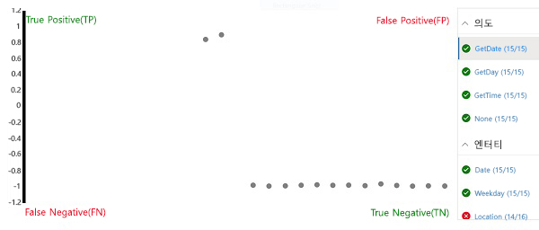

---
lab:
    title: 'Language Understanding 앱 만들기'
    module: '모듈 5 - Language Understanding 솔루션 만들기'
---

# Language Understanding 앱 만들기

Language Understanding 서비스에서는 언어 모델을 캡슐화하는 앱을 정의할 수 있습니다. 애플리케이션은 이 모델을 통해 사용자의 자연어 입력을 해석하고, 사용자의 *의도*(사용자가 달성하려는 목표)를 예측하고, 해당 의도를 적용해야 하는 *엔터티*를 식별할 수 있습니다.

예를 들어 시계 애플리케이션용 Language Understanding 앱은 다음과 같은 입력을 처리할 수 있습니다.

*What is the time in London?*

이러한 입력 유형의 예가 *발화*(사용자가 말하거나 입력하는 내용)입니다. 이 발화에서 원하는 *의도*는 특정 위치(*엔터티*), 즉 여기서는 런던의 시간을 확인하는 것입니다.

> **참고**: Language Understanding 앱은 사용자 의도를 예측하여 해당 의도가 적용되는 엔터티를 식별하는 작업을 수행합니다. 하지만 의도를 충족하는 데 필요한 작업을 실제로 수행하지는 <u>않습니다</u>. 예를 들어 시계 애플리케이션은 언어 앱을 사용해 사용자가 런던의 시간을 확인하려 한다는 것을 파악할 수는 있습니다. 그러나 이처럼 의도가 파악되고 나면 클라이언트 애플리케이션 자체가 논리를 구현해 정확한 시간을 확인하여 사용자에게 표시해야 합니다.

## 이 과정용 리포지토리 복제

이 랩에서 작업을 수행 중인 환경에 **AI-102-AIEngineer** 코드 리포지토리를 아직 복제하지 않았다면 다음 단계에 따라 리포지토리를 지금 복제합니다. 리포지토리를 복제한 경우에는 Visual Studio Code에서 복제한 폴더를 엽니다.

1. Visual Studio Code를 시작합니다.
2. 팔레트를 열고(Shift+Ctrl+P 누르기) **Git: Clone** 명령을 실행하여 `https://github.com/MicrosoftLearning/AI-102KO-Designing-and-Implementing-a-Microsoft-Azure-AI-Solution` 리포지토리를 로컬 폴더(아무 폴더나 관계없음)에 복제합니다.
3. 리포지토리가 복제되면 Visual Studio Code에서 폴더를 엽니다.
4. 리포지토리의 C# 코드 프로젝트를 지원하는 추가 파일이 설치되는 동안 기다립니다.

    > **참고**: 빌드 및 디버그에 필요한 자산을 추가하라는 메시지가 표시되면 **나중에**를 선택합니다.

## Language Understanding 리소스 만들기

Language Understanding 서비스를 사용하려면 다음과 같은 두 가지 종류의 리소스가 필요합니다.

- *작성* 리소스: Language Understanding 앱을 정의하고 학습시킨 후 테스트하는 데 사용됩니다. Azure 구독에서 **Language Understanding - 작성** 리소스를 만들어야 합니다.
- *예측* 리소스: Language Understanding 앱을 게시하고 이 앱을 사용하는 클라이언트 애플리케이션을 요청을 처리하는 데 사용됩니다. Azure 구독에서 **Language Understanding** 또는 **Cognitive Services** 리소스를 만들면 됩니다.

     > **중요**: 작성 리소스는 3개 *지역*(유럽, 오스트레일리아, 미국) 중 하나에 만들어야 합니다. 유럽 또는 오스트레일리아 작성 리소스에서 만드는 Language Understanding 앱은 각각 유럽 또는 오스트레일리아의 예측 리소스에만 배포할 수 있습니다. 미국 작성 리소스에서 만드는 모델은 유럽 및 오스트레일리아를 제외한 모든 Azure 위치의 예측 리소스에 배포할 수 있습니다. 작성 위치와 예측 위치 일치에 대한 자세한 내용은 [작성 및 게시 지역 설명서](https://docs.microsoft.com/azure/cognitive-services/luis/luis-reference-regions)를 참조하세요.

Language Understanding 작성 리소스와 예측 리소스가 아직 없으면 다음 작업을 수행합니다.

1. Azure Portal `https://portal.azure.com`을 열고 Azure 구독과 연결된 Microsoft 계정을 사용하여 로그인합니다.
2. **&#65291;리소스 만들기** 단추를 선택하고 *language understanding*을 검색한 후에 다음 설정을 사용하여 **Language Understanding** 리소스를 만듭니다.

    *Language Understanding(Azure Cognitive Services)이 <u>아닌</u> **Language Understanding**을 선택해야 합니다.*

    - **만들기 옵션**: 모두
    - **구독**: *사용자의 Azure 구독*
    - **리소스 그룹**: *리소스 그룹 선택 또는 만들기(제한된 구독을 사용 중이라면 새 리소스 그룹을 만들 권한이 없을 수도 있으므로 제공된 리소스 그룹 사용)*
    - **이름**: *고유한 이름 입력*
    - **작성 위치**: *원하는 위치 선택*
    - **작성 가격 책정 계층**: F0
    - **예측 위치**: *작성 위치와 같은 위치*
    - **예측 가격 책정 계층**: F0
3. 리소스가 작성될 때까지 기다렸다가 작성과 예측용으로 Language Understanding 리소스가 하나씩 프로비전되었는지 확인합니다. 리소스를 만든 리소스 그룹으로 이동하면 두 리소스를 모두 확인할 수 있습니다. **리소스로 이동**을 선택하면 *작성* 리소스가 열립니다.

## Language Understanding 앱 만들기

이제 작성 리소스를 만들었으므로 해당 리소스를 사용하여 Language Understanding 앱을 만들 수 있습니다.

1. 새 브라우저 탭에서 Language Understanding 포털 `https://www.luis.ai`를 엽니다.
2. Azure 구독과 연결된 Microsoft 계정으로 로그인합니다. Language Understanding 포털에 처음 로그인하는 경우 계정 세부 정보 액세스를 위한 몇 가지 권한을 앱에 부여해야 할 수 있습니다. 그런 후에 Azure 구독 및 방금 만든 작성 리소스를 선택하여 *시작* 단계를 완료합니다.

    > **참고**: 계정이 각기 다른 디렉터리의 여러 구독과 연결되어 있으면 Language Understanding 리소스를 프로비전한 구독이 포함되어 있는 디렉터리로 전환해야 할 수 있습니다.

3. **대화 앱** 페이지에서 구독 및 Language Understanding 작성 리소스가 선택되어 있는지 확인합니다. 그런 후에 다음 설정을 사용하여 대화용 새 앱을 만듭니다.
    - **이름**: Clock
    - **Culture**: 영어(*이 옵션을 사용할 수 없으면 비워 둠*)
    - **설명**: 자연어 시계
    - **예측 리소스**: *Language Understanding 예측 리소스*

    **Clock** 앱이 자동으로 열리지 않으면 앱을 엽니다.
    
    효율적인 Language Understanding 앱을 만들 수 있는 팁이 포함된 패널이 열리면 해당 패널을 닫습니다.

## 의도 만들기

새 앱에서는 먼저 몇 가지 의도를 정의합니다.

1. **의도** 페이지에서 **65291; 만들기**를 클릭하여 새 의도 **GetTime**을 만듭니다.
2. **GetTime** 의도에서 예제 사용자 입력으로 다음 발화를 추가합니다.

    *what is the time?*

    *what time is it?*

3. 이러한 발화를 추가한 후 **의도** 페이지로 돌아와서 다음 발화가 포함된 새 의도 **GetDay**를 더 추가합니다.

    *what is the day today?*

    *what day is it?*

4. 이러한 발화를 추가한 후 **의도** 페이지로 돌아와서 다음 발화가 포함된 새 의도 **GetDate**를 더 추가합니다.

    *what is the date today?*

    *what date is it?*

5. 이러한 발화를 추가한 후 **의도** 페이지로 돌아와서 **None** 의도를 선택합니다. 이 의도는 언어 모델에서 정의한 어떤 의도에도 매핑되지 않는 입력용 대체 의도로 제공됩니다.
6. **None** 의도에 다음 발화를 추가합니다.

    *hello*

    *goodbye*

## 앱 학습 및 테스트

이제 몇 가지 의도를 추가했으므로 앱을 학습시켜 사용자 입력에서 정확하게 예측을 할 수 있는지 확인해 보겠습니다.

1. 포털 오른쪽 위에서 **학습**을 선택하여 앱 학습을 진행합니다.
2. 앱 학습이 완료되면 **테스트**를 선택하여 테스트 패널을 표시한 후에 다음 테스트 발화를 입력합니다.

    *what's the time now?*

    반환되는 결과를 검토하여 예측한 의도(**GetTime**이어야 함), 그리고 모델이 예측한 의도를 대상으로 계산한 가능성을 나타내는 신뢰도 점수가 포함되어 있음을 확인합니다.

3. 다음 테스트 발화를 사용해 봅니다.

    *tell me the time*

    이번에도 예측한 의도 및 신뢰도 점수를 검토합니다.

4. 다음 테스트 발화를 사용해 봅니다.

    *what's today?*

    이 경우 모델은 **GetDay** 의도를 예측해야 합니다.

5. 마지막으로 다음 테스트 발화를 사용해 봅니다.

    *hi*

    이번에는 **None** 의도가 반환되어야 합니다.

6. 테스트 패널을 닫습니다.

## 엔터티 추가

지금까지 의도에 매핑되는 간단한 발화 몇 가지를 정의했습니다. 대다수 실제 애플리케이션에는 더 복잡한 발화가 포함됩니다. 이러한 발화에서 구체적인 데이터 엔터티를 추출하여 의도 예측을 위한 추가 컨텍스트를 수집해야 합니다.

### *기계 학습된* 엔터티 추가

가장 흔히 사용되는 엔터티 유형은 *기계 학습된* 엔터티입니다. 앱은 이 엔터티에서 예제를 기준으로 엔터티 값을 식별합니다.

1. **엔터티** 페이지에서 **65291; 만들기**를 클릭하여 새 엔터티를 만듭니다.
2. **엔터티 만들기** 대화 상자에서 **기계 학습된** 엔터티인 **Location**을 만듭니다.
3. **Location** 엔터티가 작성되면 **의도** 페이지로 돌아와서 **GetTime** 의도를 선택합니다.
4. 다음과 같은 새 예제 발화를 입력합니다.

    *what time is it in London?*

5. 이 발화를 추가한 후 단어 ***london***을 선택합니다. 그러면 표시되는 드롭다운 목록에서 **Location**을 선택하여 "london"이 위치의 예임을 지정합니다.
6. 다른 예제 발화를 추가합니다.

    *what is the current time in New York?*

7. 이 발화를 추가한 후 단어 **new york**을 선택하여 **Location** 엔터티에 매핑합니다.

### *list* 엔터티 추가

엔터티의 유효한 값을 특정 단어 및 동의어 목록으로 제한할 수 있는 경우도 있습니다. 이렇게 하면 앱이 발화의 엔터티 인스턴스를 쉽게 식별할 수 있습니다.

1. **엔터티** 페이지에서 **65291; 만들기**를 클릭하여 새 엔터티를 만듭니다.
2. **엔터티 만들기** 대화 상자에서 **List** 엔터티인 **Weekday**를 만듭니다.
3. 다음의 **정규화된 값** 및 **동의어**를 추가합니다.

    | 정규화된 값 | 동의어|
    |-------------------|---------|
    | sunday | sun |
    | monday | mon |
    | tuesday | tue |
    | wednesday | wed |
    | thursday | thu |
    | friday | fri |
    | saturday | sat |

3. **Weekday** 엔터티가 작성되면 **의도** 페이지로 돌아와서 **GetDate** 의도를 선택합니다.
4. 다음과 같은 새 예제 발화를 입력합니다.

    *what date was it on Saturday?*

5. 이 발화를 추가한 후 **saturday**가 **Weekday** 엔터티에 자동으로 매핑되었는지 확인합니다. saturday가 자동 매핑되지 않았으면 단어 ***saturday***를 선택합니다. 그러면 표시되는 드롭다운 목록에서 **Weekday**를 선택합니다.
6. 다른 예제 발화를 추가합니다.

    *what date will it be on Friday?*

7. 이 발화를 추가한 후 **friday**가 **Weekday** 엔터티에 매핑되는지 확인합니다.

### *Regex* 엔터티 추가

일련 번호, 양식 코드, 날짜 등 특정 형식으로 된 엔터티도 있습니다. 이 경우 앱이 일치하는 엔터티 값을 식별할 수 있도록 필요한 형식을 설명하는 정규식(*regex*)을 정의할 수 있습니다.

1. **엔터티** 페이지에서 **&#65291; 만들기**를 클릭하여 새 엔터티를 만듭니다.
2. **엔터티 만들기** 대화 상자에서 다음 정규식을 사용하여 **Regex** 엔터티인 **Date**를 만듭니다.

    ```
    [0-9]{2}/[0-9]{2}/[0-9]{4}
    ```

    > **참고**: 이 엔터티는 *01/11/2020*과 같은 숫자 2개+"/"+숫자 2개+"/"+숫자 4개 형식을 확인하는 간단한 정규식입니다. 그러므로 *56/00/9999* 등의 잘못된 날짜도 허용됩니다. 하지만 정규식 엔터티는 날짜 값의 유효성을 검사하는 것이 아니라 날짜로 *의도*하여 입력한 데이터 항목을 식별하는 데 사용된다는 점을 기억해야 합니다.

3. **Date** 엔터티가 작성되면 **의도** 페이지로 돌아와서 **GetDay** 의도를 선택합니다.
4. 다음과 같은 새 예제 발화를 입력합니다.

    *what day was 01/01/1901?*

5. 이 발화를 추가한 후 **01/01/1901**이 **Date** 엔터티에 자동으로 매핑되었는지 확인합니다. 이 날짜가 자동 매핑되지 않았으면 **01/01/1901**을 선택합니다. 그러면 표시되는 드롭다운 목록에서 **Date**를 선택합니다.
6. 다른 예제 발화를 추가합니다.

    *what day will it be on 12/12/2099?*

7. 이 발화를 추가한 후 **12/12/2099**가 **Date** 엔터티에 매핑되는지 확인합니다.

### 앱 다시 학습시키기

이제 언어 모델을 수정했으므로 앱을 다시 학습시켜 테스트를 다시 진행해야 합니다.

1. 포털 오른쪽 위에서 **학습**을 선택하여 앱을 다시 학습시킵니다.
2. 앱 학습이 완료되면 테스트를 선택하여 테스트 패널을 표시한 후에 다음 테스트 발화를 입력합니다.

    *what's the time in Edinburgh?*

3. 반환되는 결과를 검토합니다. 앱이 **GetTime** 의도를 예측해야 합니다. 그런 다음 **검사**를 선택하고 추가 검사 패널이 표시되면 **ML 엔터티** 섹션을 살펴봅니다. 모델이 "edinburgh"가 **Location** 엔터티 인스턴스임을 예측해야 합니다.
4. 다음 발화를 테스트해 봅니다.

    *what date is it on Friday?*

    *what's the date on Thu?*

    *what was the day on 01/01/2020?*

5. 테스트를 완료한 후 검사 패널을 닫되 테스트 패널은 열어 둡니다.

## 일괄 처리 테스트 수행

테스트 창을 사용해 개별 발화를 대화형으로 테스트할 수 있습니다. 그러나 더욱 복잡한 언어 모델의 경우에는 대개 *일괄 처리 테스트*를 수행하는 것이 더 효율적입니다.

1. Visual Studio Code에서 **09-luis-app** 폴더의 **batch-test.json** 파일을 엽니다. 이 파일은 앞에서 만든 시계 언어 모델용 테스트 사례 여러 개가 포함된 JSON 문서로 구성되어 있습니다.
2. Language Understanding 포털의 테스트 패널에서 **일괄 처리 테스트 패널**을 선택합니다. 그런 다음 **65291; 가져오기**를 선택하고 **batch-test.json** 파일을 가져와 이름 **clock-test**를 할당합니다.
3. 일괄 처리 테스트 패널에서 **clock-test** 테스트를 실행합니다.
4. 테스트가 완료되면 **결과 보기**를 선택합니다.
5. 결과 페이지에서 예측 결과가 표시된 오차 행렬을 확인합니다. 이 행렬에는 오른쪽 목록에서 선택한 의도나 엔터티에 대한 진양성, 가양성, 참 부정 및 거짓 부정이 표시됩니다.

    

    > **참고**: 각 의도와 관련하여 각 발화에는 *긍정* 또는 *부정* 점수가 부여됩니다. 예를 들어 "what time is it?"의 경우 **GetTime** 의도에는 *긍정*으로, **GetDate** 의도에는 *부정*으로 채점되어야 합니다. 오차 행렬의 점수에는 정확하게 예측된 발화(*참*)와 잘못 예측된 발화(*거짓*)가 선택한 의도의 *긍정* 및 *부정*으로 표시됩니다.

6. **GetDate** 의도를 선택하고 오차 행렬의 아무 점수나 선택하여 발화 및 예측의 신뢰도 점수를 포함한 예측 세부 정보를 확인합니다. 그런 다음 **GetDay**, **GetTime**, **None** 의도를 선택하고 각각의 예측 결과를 확인합니다. 앱이 의도를 정확하게 예측할 수 있어야 합니다.

    > **참고**: 사용자 인터페이스에서 이전에 선택한 점수가 지워지지 않을 수도 있습니다.

7. **Location** 엔터티를 선택하고 오차 행렬에서 예측 결과를 확인합니다. 특히 *거짓 부정* 예측을 자세히 살펴봅니다. 거짓 부정이란 앱이 발화에서 지정된 위치를 예측하지 못한 경우입니다. 즉, 의도에 샘플 발화를 더 추가하고 모델을 다시 학습시켜야 할 수 있습니다.
8. 일괄 처리 테스트 패널을 닫습니다.

## 앱 게시

실제 프로젝트에서는 만족할 만한 예측 성능이 제공될 때까지 의도와 엔터티를 여러 번 미세 조정하고 모델을 다시 학습시켜 테스트를 다시 진행합니다. 그런 후에 클라이언트 애플리케이션이 사용하도록 앱을 게시합니다.

1. Language Understanding 포털의 오른쪽 위에서 **게시**를 선택합니다.
2. **프로덕션 슬롯**을 선택하고 앱을 게시합니다.
3. 게시가 완료되면 Language Understanding 포털 위쪽에서 **관리**를 선택합니다.
4. **설정** 페이지에서 **앱 ID**를 확인합니다. 클라이언트 애플리케이션이 앱을 사용하려면 이 ID가 필요합니다.
5. **Azure 리소스** 페이지에서 예측 리소스의 **기본 키**, **보조 키** 및 **엔드포인트 URL**을 확인합니다. 이러한 정보가 있어야 앱을 사용할 수 있습니다. 클라이언트 애플리케이션이 예측 리소스에 연결하여 인증을 하려면 엔드포인트와 키 중 하나가 필요합니다.
6. Visual Studio Code의**09-luis-app**폴더에서 **GetIntent.cmd** 배치 파일을 선택하여 이 파일에 포함된 코드를 확인합니다. 이 명령줄 스크립트는 cURL을 사용하여 지정된 애플리케이션 및 예측 엔드포인트용으로 Language Understanding REST API를 호출합니다.
7. 스크립트의 자리 표시자 값을 Language Understanding 앱의 **앱 ID**, **엔드포인트 URL** 및 **기본 키** 또는 **보조 키** 중 하나로 바꾸고 업데이트한 파일을 저장합니다.
8. **09-luis-app** 폴더를 마우스 오른쪽 단추로 클릭하고 통합 터미널을 엽니다. 그런 후에 다음 명령을 입력합니다(따옴표도 포함해야 함).

    ```
    GetIntent "What's the time?"
    ```

9. 앱이 반환하는 JSON 응답을 검토합니다. 입력한 명령에 대해 예측된 점수가 가장 높은 의도(**GetTime**이어야 함)가 표시됩니다.
10. 다음 명령을 시도합니다.

    ```
    GetIntent "What's today's date?"
    ```

11. 응답에서 **GetDate** 의도가 예측되었는지를 확인합니다.
12. 다음 명령을 시도합니다.

    ```
    GetIntent "What time is it in Sydney?"
    ```

13. 응답에 **Location** 엔터티가 포함되어 있는지 확인합니다.

14. 다음 명령을 실행하여 응답을 살펴봅니다.

    ```
    GetIntent "What time is it in Glasgow?"
    ```

    ```
    GetIntent "What's the time in Nairobi?"
    ```

    ```
    GetIntent "What's the UK time?"
    ```
15. 몇 가지 변형 명령을 더 실행해 봅니다. **GetTime** 의도는 올바르게 예측하지만 **Location** 엔터티는 검색하지 못하는 응답을 몇 개 생성해야 합니다.

    터미널은 나중에 다시 사용할 것이므로 열어 둡니다.

## *활성 학습* 적용

엔드포인트에 제출된 발화 기록을 토대로 Language Understanding 앱을 개선할 수 있습니다. 이러한 개선 방식이 *활성 학습*입니다.

이전 절차에서는 cURL을 사용하여 앱 엔드포인트에 요청을 제출했습니다. 이러한 요청에는 쿼리 로깅 옵션이 포함되어 있었습니다. 따라서 앱이 활성 학습에 사용할 쿼리를 추적할 수 있습니다.

1. Language Understanding 포털에서 **빌드**를 선택하고 **엔드포인트 발화 검토** 페이지를 확인합니다. 이 페이지에는 서비스가 검토 대상으로 플래그를 지정한 로깅된 발화가 나열됩니다.
2. 의도와 새 위치 엔터티(원래 학습 발화에는 포함되지 않았던 엔터티)가 정확하게 예측된 발화의 경우 **&#10003;** 을 선택하여 엔터티를 확인한 다음 **&#10514;** 아이콘을 사용하여 해당 발화를 학습 예제로 의도에 추가합니다.
3. **GetTime** 의도는 정확하게 식별되었지만 **Location** 엔터티는 식별되지 <u>않은</u> 발화 예제를 찾은 다음 위치 이름을 선택하여 **location** 엔터티에 매핑합니다. 그런 후에 **&#10514;** 아이콘을 사용하여 해당 발화를 학습 예제로 의도에 추가합니다.
4. **의도** 페이지로 이동하여 **GetTime** 의도를 열고 제안 발화가 추가되었음을 확인합니다.
5. Language Understanding 포털 위쪽에서 **학습**을 선택하여 앱을 다시 학습시킵니다.
6. Language Understanding 포털 오른쪽 위에서 **게시**를 선택하여 **프로덕션 슬롯**에 앱을 다시 게시합니다.
7. **09-luis-app** 폴더의 터미널로 돌아와서 **GetIntent** 명령을 사용해 활성 학습 중에 추가 및 수정한 발화를 제출합니다.
8. 이제 결과에 **Location** 엔터티가 포함되어 있음을 확인합니다. 그런 다음 동일 구문을 사용하되 다른 위치(예: *Berlin*)를 지정하는 다른 발화를 실행해 봅니다.

## 앱 내보내기

Language Understanding 포털을 사용하면 언어 앱을 개발하고 테스트할 수 있습니다. 그러나 DevOps용 소프트웨어 개발 프로세스에서는 CI/CD(연속 통합/지속적인 업데이트) 파이프라인에 포함할 수 있는 앱의 원본 제어 정의를 유지 관리해야 합니다. 코드 스크립트에서 REST API 또는 Language Understanding SDK를 사용하여 앱을 만들고 학습시킬 수도 *있습니다*. 하지만 포털을 사용하여 앱을 만든 후에 다른 Language Understanding 인스턴스에서 가져와 다시 학습시킬 수 있는 *lu* 파일로 내보내는 방식이 더 간편합니다. 이 방식을 사용하면 생산성이 우수한 포털을 활용하는 동시에 앱의 이동성과 재현 가능성도 유지할 수 있습니다.

1. Language Understanding 포털에서 **관리**를 선택합니다.
2. **버전** 페이지에서 앱의 현재 버전을 선택합니다(버전은 하나뿐임).
3. **내보내기** 드롭다운 목록에서 **LU로 내보내기**를 선택합니다. 그런 다음 브라우저에서 메시지가 표시되면 **09-luis-app** 폴더에 파일을 저장합니다.
4. Visual Studio Code에서 방금 내보낸 후 다운로드한 **lu** 파일을 엽니다(Marketplace에서 해당 파일을 읽을 수 있는 확장을 검색하라는 메시지가 표시되면 해당 메시지를 해제하면 됨). LU는 사람이 읽을 수 있는 형식이므로 팀 개발 환경에서 Language Understanding 앱의 정의를 효율적으로 문서화할 수 있습니다.

## 추가 정보

**Language Understanding** 서비스를 사용하는 방법에 대한 자세한 내용은 [Language Understanding 설명서](https://docs.microsoft.com/azure/cognitive-services/luis/)를 참조하세요.
