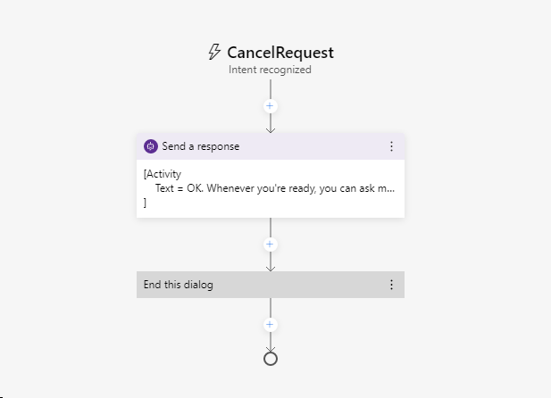

---
lab:
  title: Bot Framework Composer를 사용하여 봇 만들기
  module: Module 7 - Conversational AI and the Azure Bot Service
---

# <a name="create-a-bot-with-bot-framework-composer"></a>Bot Framework Composer를 사용하여 봇 만들기

Bot Framework Composer is a graphical designer that lets you quickly and easily build sophisticated conversational bots without writing code. The composer is an open-source tool that presents a visual canvas for building bots.

## <a name="prepare-to-develop-a-bot"></a>봇 개발 준비

먼저 봇을 개발하는 데 필요한 서비스와 도구를 준비해보겠습니다.

### <a name="get-an-openweather-api-key"></a>OpenWeather API 키 가져오기

In this exercise, you will create a bot that uses the OpenWeather service to retrieve weather conditions for the city entered by the user. You will require an API key for the service to work.

1. 웹 브라우저에서 OpenWeather 사이트 `https://openweathermap.org/price`로 이동합니다.
2. 무료 API 키를 요청하고 OpenWeather 계정을 만듭니다(계정이 아직 없는 경우).
3. 등록 후 **API keys** 페이지를 표시하여 API 키를 확인합니다.

### <a name="update-bot-framework-composer"></a>Bot Framework Composer 업데이트

You're going to use the Bot Framework Composer to create your bot. This tools is updated regularly, so let's make sure you have the latest version installed.

> **참고**: 업데이트에는 이 연습의 지침에 영향을 주는 사용자 인터페이스 변경 내용이 포함되어 있을 수 있습니다.

1. **Bot Framework Composer**를 시작합니다. 자동으로 메시지가 표시되지 않으면 **도움말** 메뉴의 **업데이트 확인** 옵션을 사용하여 메뉴를 확인합니다.
2. 코드를 작성하지 않고도 정교한 대화형 봇을 빠르고 쉽게 빌드할 수 있는 그래픽 디자이너인 Bot Framework Composer는
3. Bot Framework Composer 버전이 **2.0.0** 이상인지 확인합니다.

## <a name="create-a-bot"></a>봇 만들기

이제 Bot Framework Composer를 사용하여 봇을 만들 준비가 되었습니다.

### <a name="create-a-bot-and-customize-the-welcome-dialog-flow"></a>봇 생성 및 "시작" 대화 흐름 사용자 지정

1. 아직 열려 있지 않으면 Bot Framework Composer를 시작합니다.
2. Composer는 봇을 빌드하는 데 사용할 시각적 캔버스를 제공하는 오픈 소스 도구입니다.
3. Close the <bpt id="p1">**</bpt>Get Started<ept id="p1">**</ept> pane if it opens, and then in the navigation pane on the left, select <bpt id="p2">**</bpt>Greeting<ept id="p2">**</ept> to open the authoring canvas and show the <bpt id="p3">*</bpt>ConversationUpdate<ept id="p3">*</ept> activity that is called when a user initially joins a conversation with the bot. The activity consists of a flow of actions.
4. 오른쪽 속성 창 맨 위에서 **인사말**이라는 단어를 선택하고 **WelcomeUsers**로 변경하여 **인사말** 제목을 편집합니다.
5. In the authoring canvas, select the <bpt id="p1">**</bpt>Send a response<ept id="p1">**</ept> action. Then, in the properties pane, change the default text from <bpt id="p1">*</bpt>Hi to your bot<ept id="p1">*</ept>  to <ph id="ph1">`Hi! I'm WeatherBot.`</ph>
6. 제작 캔버스에서 마지막 **+** 기호(대화 흐름 <u>끝</u>을 표시하는 원 바로 위에 있음)를 선택하고 **텍스트** 응답에 대해 새 **질문하기** 작업을 추가합니다.

    The new action creates two nodes in the dialog flow. The first node defines a prompt for the bot to ask the user a question, and the second node represents the response that will be received from the user. In the properties pane, these nodes have corresponding <bpt id="p1">**</bpt>Bot response<ept id="p1">**</ept> and <bpt id="p2">**</bpt>User input<ept id="p2">**</ept> tabs.

7. In the properties pane, on the <bpt id="p1">**</bpt>Bot response<ept id="p1">**</ept> tab, add a response with the text <ph id="ph1">`What's your name?`</ph>. Then, on the <bpt id="p1">**</bpt>User input<ept id="p1">**</ept> tab, set the <bpt id="p2">**</bpt>Property<ept id="p2">**</ept> value to <ph id="ph1">`user.name`</ph> to define a variable that you can access later in the bot conversation.
8. 제작 캔버스로 돌아가서 방금 추가한 **사용자 입력(텍스트)** 작업에서 **+** 기호를 선택하고 **응답 보내기** 작업을 추가합니다.
9. 새로 추가한 **응답 보내기** 작업을 선택하고 속성 창에서 텍스트 값을 `Hello ${user.name}, nice to meet you!`로 설정합니다.

    완료된 활동 흐름은 다음과 같아야 합니다.

    

### <a name="test-the-bot"></a>봇 테스트

기본 봇이 완료되었으므로 이제 테스트해 보겠습니다.

1. 이 연습에서는 OpenWeather 서비스를 사용하여 사용자가 입력한 도시의 기상 상황을 검색하는 봇을 만듭니다.

    - Windows 방화벽 메시지가 표시되면 모든 네트워크에 대한 액세스를 사용하도록 설정합니다.

2. **로컬 봇 런타임 관리자** 창에서 **웹 채팅 열기**를 선택합니다.
3. 서비스가 작동하려면 API 키가 필요합니다.
4. 봇에 **Hello *your_name*, nice to meet you!라는 응답이 표시됩니다**.
5. 웹 채팅 패널을 닫습니다.
6. Composer의 오른쪽 상단, **&#8635;봇 재시작** 옆에서 **<u>=</u>** 를 클릭하여 **로컬 봇 런타임 관리자** 창을 열고 ⏹ 아이콘을 사용하여 봇을 중지합니다.

## <a name="add-a-dialog-to-get-the-weather"></a>날씨 정보를 얻기 위한 대화 추가

Now that you have a working bot, you can expand its capabilities by adding dialogs for specific interactions. In this case, you'll add a dialog that is triggered when the user mentions "weather".

### <a name="add-a-dialog"></a>대화 추가

먼저 날씨에 대한 질문을 처리하는 데 사용되는 대화 흐름을 정의해야 합니다.

1. Composer의 탐색 창에서 최상위 노드(**WeatherBot**) 위에 마우스를 놓고 **...** 메뉴에서 그림과 같이 **+ 대화 추가**를 선택합니다.

    

    그런 다음 설명을 **제공된 우편 번호에 해당하는 지역의 현재 기상 상황 가져오기**로 지정하여 새 대화 **GetWeather**를 작성합니다.
2. In the navigation pane, select the <bpt id="p1">**</bpt>BeginDialog<ept id="p1">**</ept> node for the new <bpt id="p2">**</bpt>GetWeather<ept id="p2">**</ept> dialog. Then on the authoring canvas, use the <bpt id="p1">**</bpt><ph id="ph1">+</ph><ept id="p1">**</ept> symbol to add a <bpt id="p2">**</bpt>Ask a question<ept id="p2">**</ept> action for a <bpt id="p3">**</bpt>Text<ept id="p3">**</ept> response.
3. 속성 창의 **봇 응답** 탭에서 `Enter your city.`에 대한 응답을 추가합니다.
4. **사용자 입력** 탭에서 **속성** 필드를 `dialog.city`로 설정하고, 사용자가 제공한 값 앞뒤의 불필요한 공백이 제거되도록 **출력 형식** 필드를 `=trim(this.value)` 식으로 설정합니다.

    지금까지 활동 흐름은 다음과 같습니다.

    

    So far, the dialog asks the user to enter a city. Now you must implement the logic to retrieve the weather information for the city that was entered.

6. 제작 캔버스의 도시 입력을 위한 **사용자 입력**  작업 바로 아래에서 **+** 기호를 선택하여 새 작업을 추가합니다.
7. 작업 목록에서 **외부 리소스에 액세스**와 **HTTP 요청 보내기**를 순서대로 선택합니다.
8. **HTTP 요청**의 속성을 다음과 같이 설정합니다. **YOUR_API_KEY**는 [OpenWeather](https://openweathermap.org/price) API 키로 바꿉니다.
    - **HTTP 메서드**: GET
    - **Url**: `http://api.openweathermap.org/data/2.5/weather?units=metric&q=${dialog.city}&appid=YOUR_API_KEY`
    - **결과 속성**: `dialog.api_response`

    결과에는 HTTP 응답에서 다음 네 가지 속성 중 하나가 포함될 수 있습니다.

    - <bpt id="p1">**</bpt>statusCode<ept id="p1">**</ept>. Accessed via <bpt id="p1">**</bpt>dialog.api_response.statusCode<ept id="p1">**</ept>.
    - <bpt id="p1">**</bpt>reasonPhrase<ept id="p1">**</ept>. Accessed via <bpt id="p1">**</bpt>dialog.api_response.reasonPhrase<ept id="p1">**</ept>.
    - Bot Framework Composer 사용하여 봇을 만들겠습니다.
    - 이 도구는 정기적으로 업데이트되므로 최신 버전이 설치되어 있는지 확인해 보겠습니다.

    Additionally, if the response type is JSON, it will be a deserialized object available via <bpt id="p1">**</bpt>dialog.api_response.content<ept id="p1">**</ept> property. For detailed information about the OpenWeather API and the response it returns, see the <bpt id="p1">[</bpt>OpenWeather API documentation<ept id="p1">](https://openweathermap.org/current)</ept>.

    이제 응답을 처리하는 대화 흐름에 논리를 추가해야 합니다. 이는 HTTP 요청의 성공 또는 실패를 나타낼 수 있습니다.

9. On the authoring canvas, under the <bpt id="p1">**</bpt>Send HTTP Request<ept id="p1">**</ept> action you created, add a <bpt id="p2">**</bpt>Create a condition<ept id="p2">**</ept><ph id="ph1"> &gt; </ph><bpt id="p3">**</bpt>Branch: if/else<ept id="p3">**</ept> action. This action defines a branch in the dialog flow with <bpt id="p1">**</bpt>True<ept id="p1">**</ept> and <bpt id="p2">**</bpt>False<ept id="p2">**</ept> paths.
10. 분기 작업의 **속성**에서 다음 식을 쓰도록 **조건** 필드를 설정합니다.

    ```
    =dialog.api_response.statusCode == 200
    ```

11. If the call was successful, you need to store the response in a variable. On the authoring canvas, in the <bpt id="p1">**</bpt>True<ept id="p1">**</ept> branch, add a <bpt id="p2">**</bpt>Manage properties<ept id="p2">**</ept><ph id="ph1"> &gt; </ph><bpt id="p3">**</bpt>Set properties<ept id="p3">**</ept> action. Then in the properties pane, add the following property assignments:

    | 속성 | 값 |
    | -- | -- |
    | `dialog.weather` | `=dialog.api_response.content.weather[0].description` |
    | `dialog.temp` | `=round(dialog.api_response.content.main.temp)` |
    | `dialog.icon` | `=dialog.api_response.content.weather[0].icon` |

12. 계속 **True** 분기를 표시한 상태로 **속성 설정** 작업 아래에 **응답 보내기** 작업을 추가하고 해당 텍스트를 다음과 같이 설정합니다.

    ```
    The weather in ${dialog.city} is ${dialog.weather} and the temperature is ${dialog.temp}&deg;.
    ```

    사용 가능한 업데이트가 있으면 애플리케이션이 닫힐 때 설치하는 옵션을 선택합니다.

13. 200이 아닌 기상 서비스의 응답도 고려해야 하므로 **False** 분기에서 **응답 보내기** 작업을 추가하고 해당 텍스트를 `I got an error: ${dialog.api_response.content.message}.`로 설정

    여기까지 작성한 대화 흐름은 다음과 같습니다.

    

### <a name="add-a-trigger-for-the-dialog"></a>대화의 트리거 추가

이제 기존 시작 대화에서 새 대화를 시작하는 방법이 필요합니다.

1. 탐색 창에서 **WelcomeUsers**가 포함된 **WeatherBot** 대화를 선택합니다(이름이 같은 최상위 봇 노드 아래에 있음).

    

2. 선택한 **WeatherBot** 대화의 속성 창에 있는 **Language Understanding** 섹션에서 **인식기 형식**을 **정규식 인식기**로 설정합니다.

    > 그런 다음에 Bot Framework Composer를 닫고 현재 로그인된 사용자에 대해 업데이트를 설치합니다. 설치가 완료되면 Bot Framework Composer를 다시 시작합니다.

3. **WeatherBot** 대화의 **...** 메뉴에서 **새 트리거 추가**를 선택합니다.

    

    다음 설정을 사용하여 트리거를 생성합니다.

    - **이 트리거의 형식은 무엇인가요?**: 의도 인식
    - **이 트리거(RegEx)의 이름은 무엇인가요?** : `WeatherRequested`
    - **정규식 패턴을 입력하세요.** : `weather`

    > 설치하는 데 몇 분 정도 걸릴 수 있습니다.

4. Now that the trigger is created, you need to configure an action for it. In the authoring canvas for the trigger, select the <bpt id="p1">**</bpt><ph id="ph1">+</ph><ept id="p1">**</ept> symbol under your new <bpt id="p2">**</bpt>WeatherRequested<ept id="p2">**</ept> trigger node. Then in the list of actions, select <bpt id="p1">**</bpt>Dialog Management<ept id="p1">**</ept> and select <bpt id="p2">**</bpt>Begin a new dialog<ept id="p2">**</ept>.
5. **새 대화 시작** 작업을 선택한 상태로 속성 창의 **대화 이름** 드롭다운 목록에서 **GetWeather** 대화를 선택합니다. 그러면 **WeatherRequested** 트리거가 인식될 때 앞에서 정의한 **GetWeather** 대화가 시작됩니다.

    **WeatherRequested** 활동 흐름은 다음과 같습니다.

    

6. Restart the bot and open the web chat pane.Then restart the conversation, and after entering your name, enter <ph id="ph1">`What is the weather like?`</ph>. Then, when prompted, enter a city, such as <ph id="ph1">`Seattle`</ph>. The bot will contact the service and should respond with a small weather report statement.
7. 테스트가 완료되면 웹 채팅 창을 닫고 봇을 중지합니다.

## <a name="handle-interruptions"></a>중단 처리

적절하게 디자인된 봇과 대화를 할 때 사용자는 요청을 취소하는 등의 작업을 통해 대화 흐름을 변경할 수 있습니다.

1. In the Bot Composer, in the navigation pane, use the <bpt id="p1">**</bpt>...<ept id="p1">**</ept> menu for the <bpt id="p2">**</bpt>WeatherBot<ept id="p2">**</ept> dialog to add a new trigger (in addition to the existing <bpt id="p3">**</bpt>WelcomeUsers<ept id="p3">**</ept> and <bpt id="p4">**</bpt>WeatherRequested<ept id="p4">**</ept> triggers). The new trigger should have the following settings:

    - **이 트리거의 형식은 무엇인가요?**: 의도 인식
    - **이 트리거(RegEx)의 이름은 무엇인가요?** : `CancelRequest`
    - **정규식 패턴을 입력하세요.** : `cancel`

    > 정규식 패턴 텍스트 상자에 입력하는 텍스트는 봇이 들어오는 메시지에서 *cancel*이라는 단어를 찾도록 하는 간단한 정규식 패턴입니다.

2. 트리거의 제작 캔버스에서 **응답 보내기** 작업을 추가하고 해당 텍스트 응답을 `OK. Whenever you're ready, you can ask me about the weather.`로 설정합니다.
3. **응답 보내기** 작업 아래에서 **대화 관리** 및 **이 대화 종료**를 선택하여 대화를 종료합니다.

    **CancelRequest** 대화 흐름은 다음과 같습니다.

    

    이제 사용자의 취소 요청에 응답을 하는 트리거를 추가했으므로, 날씨 정보를 물은 후 우편 번호를 입력하라는 메시지가 표시되는 등의 경우에 사용자가 취소를 요청하면 대화 흐름 중단을 허용해야 합니다.

4. 탐색 창의 **GetWeather** 대화 아래에서 **BeginDialog**를 선택합니다.
5. 사용자에게 도시를 입력하라는 메시지를 표시하는 **텍스트에 대한 프롬프트** 작업을 선택합니다.
6. 작업 속성의 **기타** 탭에서 **프롬프트 구성**을 확장하고 **중단 허용** 속성을 **true**로 설정합니다.
7. Restart the bot and open the web chat pane. Restart the conversation, and and after entering your name, enter <ph id="ph1">`What is the weather like?`</ph>. Then, when prompted, enter <ph id="ph1">`cancel`</ph>, and confirm that the request is canceled.
8. 요청을 취소한 후 `What's the weather like?`를 입력합니다. 그러면 해당 트리거가 **GetWeather** 대화의 새 인스턴스를 시작하며 도시를 입력하라는 메시지가 다시 표시됩니다.
9. 테스트가 완료되면 웹 채팅 창을 닫고 봇을 중지합니다.

## <a name="enhance-the-user-experience"></a>사용자 환경 개선

The interactions with the weather bot so far has been through text.  Users enter text for their intentions and the bot responds with text. While text is often a suitable way to communicate, you can enhance the experience through other forms of user interface element.  For example, you can use buttons to initiate recommended actions, or display a <bpt id="p1">*</bpt>card<ept id="p1">*</ept> to present information visually.

### <a name="add-a-button"></a>단추 추가

1. Bot Framework Composer 탐색 창의 **GetWeather** 작업 아래에서 **BeginDialog**를 선택합니다.
2. 제작 캔버스에서 도시에 대한 프롬프트를 포함하는 **텍스트 프롬프트** 작업을 선택합니다.
3. 속성 창에서 **코드 표시**를 선택하고 기존 코드를 다음 코드로 바꿉니다.

```
[Activity    
    Text = Enter your city.
    SuggestedActions = Cancel
]
```

이 활동에서도 이전처럼 사용자에게 도시를 입력하라는 메시지가 표시되지만 **취소** 단추도 함께 표시됩니다.

### <a name="add-a-card"></a>카드 추가

1. **GetWeather** 대화의 **True** 경로에서 HTTP 날씨 서비스의 응답을 확인한 후 일기 예보를 표시하는 **응답 보내기** 작업을 선택합니다.
2. 속성 창에서 **코드 표시**를 선택하고 기존 코드를 다음 코드로 바꿉니다.

```
[ThumbnailCard
    title = Weather for ${dialog.city}
    text = ${dialog.weather} (${dialog.temp}&deg;)
    image = http://openweathermap.org/img/w/${dialog.icon}.png
]
```

이 템플릿은 날씨 조건에 대해 이전과 동일한 변수를 사용하지만 날씨 조건에 대한 이미지와 함께 표시될 카드에 제목을 추가합니다.

### <a name="test-the-new-user-interface"></a>새 사용자 인터페이스 테스트

1. Restart the bot and open the web chat pane. Restart the conversation, and after entering your name, enter <ph id="ph1">`What is the weather like?`</ph>. Then, when prompted, click the <bpt id="p1">**</bpt>Cancel<ept id="p1">**</ept> button to cancel the request.
2. **홈** 화면에서 **새로 생성**를 선택합니다.
3. 테스트가 완료되면 에뮬레이터를 닫고 봇을 중지합니다.

## <a name="more-information"></a>추가 정보

Bot Framework Composer에 대해 자세히 알아보려면 [Bot Framework Composer 설명서](https://docs.microsoft.com/composer/introduction)를 참조하세요.
