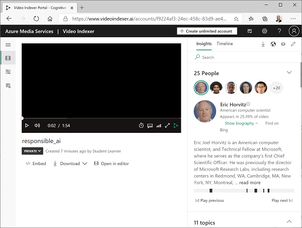

---
lab:
    title: 'Video Indexer를 사용하여 비디오 분석'
    module: '모듈 8 - Computer Vision 시작'
---

# Video Indexer를 사용하여 비디오 분석

오늘날 생성 및 사용되고 있는 데이터 중 대부분은 비디오 형식입니다. AI 지원 서비스인 **Video Indexer**를 사용하면 비디오를 인덱싱하고 비디오에서 인사이트를 추출할 수 있습니다.

## 이 과정용 리포지토리 복제

이 랩에서 작업을 수행 중인 환경에 **AI-102-AIEngineer** 코드 리포지토리를 이미 복제했다면 Visual Studio Code에서 해당 리포지토리를 열고, 그렇지 않으면 다음 단계에 따라 리포지토리를 지금 복제합니다.

1. Visual Studio Code를 시작합니다.
2. 팔레트를 열고(Shift+Ctrl+P 누르기) **Git: Clone** 명령을 실행하여 `https://github.com/MicrosoftLearning/AI-102KO-Designing-and-Implementing-a-Microsoft-Azure-AI-Solution` 리포지토리를 로컬 폴더(아무 폴더나 관계없음)에 복제합니다.
3. 리포지토리가 복제되면 Visual Studio Code에서 폴더를 엽니다.
4. 리포지토리의 C# 코드 프로젝트를 지원하는 추가 파일이 설치되는 동안 기다립니다.

    > **참고**: 빌드 및 디버그에 필요한 자산을 추가하라는 메시지가 표시되면 **나중에**를 선택합니다.

## Video Indexer에 비디오 업로드

먼저 Video Indexer 포털에 로그인하여 비디오를 업로드해야 합니다.

> **팁**: 호스형 랩 환경에서 Video Indexer 페이지 로드 속도가 느리면 로컬에 설치된 브라우저를 사용하세요. 이후 작업에서 호스트된 VM으로 다시 전환할 수 있습니다.

1. 브라우저에서 Video Indexer 포털 `https://www.videoindexer.ai`를 엽니다.
2. 기존 Video Indexer 계정이 있으면 해당 계정에 로그인합니다. 기존 계정이 없으면 무료 계정을 신청한 다음 Microsoft 계정(또는 기타 유효한 계정 유형)을 사용하여 로그인합니다. 로그인 과정에서 문제가 발생하면 프라이빗 브라우저 세션을 열어 보세요.
3. Video Indexer에서 **업로드** 옵션을 선택합니다. 그런 다음 **파일 URL 입력** 옵션을 선택하고 `https://aka.ms/responsible-ai-video`를 입력합니다. 기본 이름을 **Responsible AI**로 변경하고 기본 설정을 검토한 후 체크박스를 선택하여 Microsoft의 얼굴 인식 정책 준수 여부를 확인한 다음 파일을 업로드합니다.
4. 파일이 업로드되면 Video Indexer에서 파일을 자동으로 인덱싱하는 동안 잠시 기다립니다.

> **참고**: 이 연습에서는 이 비디오를 사용해 Video Indexer 기능을 살펴봅니다. 이 비디오에는 AI 지원 애플리케이션을 책임감 있는 방식으로 개발하는 방법과 관련된 유용한 정보 및 지침이 포함되어 있으므로, 연습을 마친 후 비디오를 끝까지 시청해야 합니다. 

## 비디오 인사이트 검토

인덱싱 프로세스에서는 비디오의 인사이트가 추출됩니다. 추출된 인사이트는 포털에서 확인할 수 있습니다.

1. 비디오가 인덱싱되면 Video Indexer 포털에서 비디오를 선택하여 표시합니다. 비디오에서 추출된 인사이트가 표시되는 창 옆에 비디오 플레이어가 있습니다.

2. 비디오가 재생되면 **타임라인** 탭을 선택하여 비디오 오디오의 대본을 확인합니다.

3. 포털 오른쪽 위에서 **보기** 기호(&#128455; 모양)를 선택하고 인사이트 목록에서 **대본** 외에 **OCR** 및 **발표자**도 선택합니다.

4. 이제 **타임라인** 창에는 다음 항목이 포함되어 있습니다.
    - 오디오 내레이션 대본
    - 비디오에 표시되는 텍스트
    - 비디오에 나오는 발표자 표시 잘 알려진 사람은 이름으로 자동 인식되며, 그 외의 사람은 숫자(예: *발표자 1번*)로 표시됩니다.
5. **인사이트** 창으로 다시 전환한 다음 해당 창에 표시되는 인사이트를 확인합니다. 다음과 같은 인사이트가 표시됩니다.
    - 비디오에 나오는 각 사람
    - 비디오에서 논의하는 토픽
    - 비디오에 나오는 물체의 레이블
    - 비디오에 나오는 사람, 브랜드 등의 명명된 엔터티
    - 주요 장면
6. **인사이트** 창을 표시한 상태로 **보기** 기호를 다시 선택하고 인사이트 목록에서 **키워드** 및 **감정**을 창에 추가합니다.

    여기서 확인되는 인사이트를 통해 비디오의 기본 주제를 파악할 수 있습니다. 예를 들어 이 비디오의 **토픽**으로는 기술, 사회적 책임, 윤리 등이 표시됩니다.

## 인사이트 검색

Video Indexer를 사용해 비디오에서 인사이트를 검색할 수 있습니다.

1. **인사이트** 창의 **검색** 상자에서 *Bee*를 입력합니다. 모든 인사이트 유형의 결과를 확인하려면 인사이트 창을 아래쪽으로 스크롤해야 할 수 있습니다.
2. 일치 *레이블* 1개가 검색되며, 비디오에서 해당 레이블의 위치가 결과 아래에 표시됩니다.
3. Bee(벌)가 나오는 섹션 시작 부분을 선택하고 해당 시점부터 비디오를 시청합니다(벌은 아주 잠깐만 나오므로 비디오를 일시 중지하고 시작 부분을 정확하게 선택해야 할 수 있음).
4. **검색** 상자의 내용을 지워 비디오의 모든 인사이트를 표시합니다.

## 인사이트 편집

Video Indexer를 사용하면 확인된 인사이트를 편집하여 비디오에 더욱 적합한 사용자 지정 정보를 추가할 수 있습니다.

1. 비디오를 시작 부분으로 되감고 **인사이트** 창 위쪽에 나열된 **사람**을 확인합니다. 컴퓨터 과학자이자 Microsoft 소속 기술 전문가인 **Eric Horwitz**를 비롯한 사람 몇 명이 인식되었음을 확인합니다.

2. Eric Horwitz의 사진을 선택하고 아래에 표시되는 정보를 확인합니다. **소개 표시** 섹션을 확장하면 이 사람에 대한 정보를 확인할 수 있습니다.
3. 비디오에서 이 사람이 나오는 위치도 표시됩니다. 이러한 위치를 참조하여 비디오의 해당 섹션을 시청할 수 있습니다.
4. 비디오 플레이어에서 0:34초 정도에 말을 하는 사람을 찾습니다.

5. 이 사람은 인식되지 않았으며 **알 수 없음 1번** 등의 일반 이름이 할당되었습니다. 그러나 이 사람의 이름이 포함된 캡션이 비디오에 표시되므로 이 사람의 세부 정보를 편집하여 인사이트를 보강할 수 있습니다.
6. 포털 오른쪽 위에서 **편집** 아이콘(&#x1F589;)을 선택합니다. 그런 다음 알 수 없는 사람의 이름을 **Natasha Crampton**으로 변경합니다.

7. 이름을 변경한 후 **인사이트** 창에서 *Natasha*를 검색합니다. 사람 1명, 그리고 이 사람이 나오는 비디오 섹션이 포함된 결과가 반환됩니다.
8. 포털 왼쪽 위에서 메뉴(&#8801;)를 확장하고 **모델 사용자 지정** 페이지를 선택합니다. 그런 다음 **사람** 탭에서 **기본** 사람 모델에 사람이 1명 포함되어 있음을 확인합니다. 앞에서 이름을 지정한 사람이 사람 모델에 추가된 것입니다. 그러므로 계정에서 추가로 인덱싱하는 비디오에서는 이 사람이 인식됩니다.

기본 사람 모델에 사람 이미지를 추가하거나 고유한 새 모델을 추가할 수 있습니다. 이렇게 하면 얼굴 이미지로 사람 컬렉션을 정의할 수 있으므로 Video Indexer가 비디오에서 이러한 사람을 인식할 수 있습니다.

그리고 언어(예: Video Indexer에서 인식하도록 할 업계별 용어 지정) 및 브랜드(예: 회사 또는 제품 이름)용 사용자 지정 모델을 만들 수도 있습니다.

## Video Indexer 위젯 사용

Video Indexer 포털은 비디오 인덱싱 프로젝트를 관리할 수 있는 유용한 인터페이스입니다. 그러나 Video Indexer 계정 액세스 권한이 없는 사용자에게 비디오와 인사이트를 제공해야 하는 경우도 많습니다. Video Indexer에서는 이러한 용도로 웹 페이지에 포함할 수 있는 위젯을 제공합니다.

1. Visual Studio Code의 **16-video-indexer** 폴더에서 **analyze-video.html**을 엽니다. 이 기본 HTML 페이지를 Video Indexer **플레이어** 및 **인사이트** 위젯에 추가합니다. 이 파일의 헤더에는 **vb.widgets.mediator.js** 스크립트 참조가 있습니다. 이 스크립트를 실행하면 페이지의 여러 Video Indexer 위젯이 서로 상호 작용할 수 있습니다.
2. Video Indexer 포털에서 **미디어 파일** 페이지로 돌아와 **Responsible AI** 비디오를 엽니다.
3. 비디오 플레이어 아래에서 **&lt;/&gt; 포함**을 선택하여 위젯을 포함할 HTML iframe 코드를 표시합니다.
4. **퍼가기 및 공유** 대화 상자에서 **플레이어** 위젯을 선택하고 비디오 크기를 560 x 315로 설정한 다음 클립보드에 embed 태그를 복사합니다.
5. Visual Studio Code의 **analyze-video.html** 파일에서 **&lt;-- 플레이어 위젯 위치 -- &gt;** 주석 아래에 복사한 코드를 붙여넣습니다.
6. **퍼가기 및 공유** 대화 상자로 돌아와 **인사이트** 위젯을 선택하고 클립보드에 embed 태그를 복사합니다. 그런 다음 **퍼가기 및 공유** 대화 상자를 닫고 Visual Studio Code로 다시 전환하여 **&lt;-- 인사이트 위젯 위치 -- &gt;** 주석 아래에 복사한 코드를 붙여넣습니다.
7. 파일을 저장합니다. **탐색기** 창에서 **analyze-video.html**을 마우스 오른쪽 단추로 클릭하고 **파일 탐색기에 표시**를 선택합니다.
8. 파일 탐색기에서 **analyze-video.html**을 브라우저에서 열어 웹 페이지를 표시합니다.
9. 위젯을 사용해 봅니다. 예를 들어 **인사이트** 위젯을 사용해 인사이트를 검색한 다음 비디오에서 해당 인사이트가 나오는 위치로 이동합니다.

## Video Indexer REST API 사용

Video Indexer는 계정에서 비디오를 업로드하고 관리하는 데 사용할 수 있는 REST API를 제공합니다.

### API 세부 정보 가져오기

Video Indexer API를 사용하려면 요청 인증을 위한 몇 가지 정보가 필요합니다.

1. Video Indexer 포털에서 메뉴(≡)를 확장하고 **계정 설정** 페이지를 선택합니다.
2. 나중에 필요하므로 이 페이지의 **계정 ID**를 적어 둡니다.
3. 새 브라우저 탭을 열고 Video Indexer 개발자 포털 `https://api-portal.videoindexer.ai`로 이동하여 Video Indexer 계정의 자격 증명을 사용해 로그인합니다.
4. **프로필** 페이지에서 프로필과 연관된 **구독**을 봅니다.
5. 구독이 표시된 페이지에서 각 구독에 키 2개(기본 키와 보조 키)가 할당되었음을 확인합니다. 그런 다음 두 키 중 하나에서 **표시**를 선택하여 키를 확인합니다. 잠시 후에 이 키가 필요합니다.

### REST API 사용

계정 ID와 API 키를 확인했으므로 REST API를 사용하여 계정에서 비디오 관련 작업을 할 수 있습니다. 이 절차에서는 PowerShell 스크립트를 사용하여 REST 호출을 수행합니다. 하지만 cURL, Postman 등의 HTTP 유틸리티나 HTTP를 통해 JSON을 보내고 받을 수 있는 모든 프로그래밍 언어에도 같은 원칙이 적용됩니다.

Video Indexer REST API와의 모든 상호 작용에서는 동일한 패턴이 사용됩니다.

- 헤더에서 API 키가 포함된 **AccessToken** 메서드로의 초기 요청을 사용하여 액세스 토큰을 가져옵니다.
- 후속 요청에서는 비디오 작업을 위해 REST 메서드를 호출할 때 이 액세스 토큰을 사용해 인증을 합니다.

1. Visual Studio Code의 **16-video-indexer** 폴더에서 **get-videos.ps1**을 엽니다.
2. PowerShell 스크립트에서 **YOUR_ACCOUNT_ID** 및 **YOUR_API_KEY** 자리 표시자를 앞에서 확인한 계정 ID 및 API 키 값으로 바꿉니다.
3. 무료 계정의 *location*은 "trial"입니다. 무제한 Video Indexer 계정(Azure 리소스가 연결되어 있음)을 만든 경우 이 값을 Azure 리소스가 프로비전된 위치(예: "eastus")로 변경할 수 있습니다.
4. 스크립트의 코드를 검토합니다. 코드에서는 REST 메서드 2개가 호출됩니다. 하나는 액세스 토큰을 가져오는 메서드이고, 다른 하나는 계정에 비디오를 나열하는 메서드입니다.
5. 변경 내용을 저장하고 스크립트 창 오른쪽 위에서 **&#9655;** 단추를 사용하여 스크립트를 실행합니다.
6. REST 서비스의 JSON 응답을 확인합니다. 앞에서 인덱싱한 **Responsible AI** 비디오의 세부 정보가 응답에 포함되어 있습니다.

## 자세한 정보

**Video Indexer**에 대한 자세한 내용은 [Video Indexer 설명서](https://docs.microsoft.com/azure/media-services/video-indexer/)를 참조하세요.
