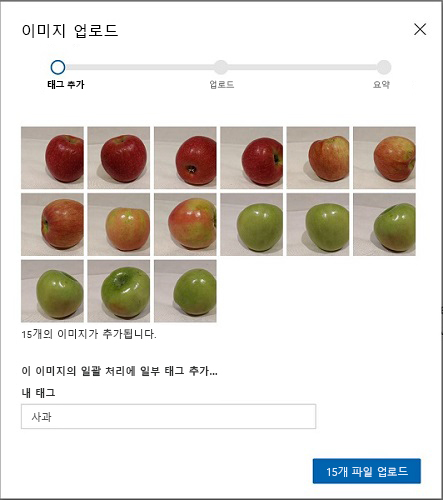
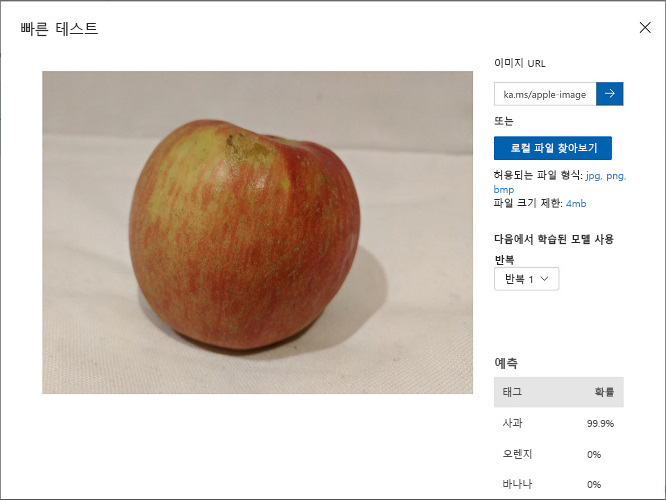

---
lab:
    title: 'Custom Vision을 사용하여 이미지 분류'
    module: '모듈 9 - Custom Vision 솔루션 개발'
---

# Custom Vision을 사용하여 이미지 분류

**Custom Vision** 서비스에서는 고유한 이미지로 학습시킬 수 있는 Computer Vision 모델을 만들 수 있습니다. 즉, 이 서비스에서는 *이미지 분류* 및 *개체 감지* 모델을 학습시킨 다음 게시하여 애플리케이션에서 사용할 수 있습니다.

이 연습에서는 Custom Vision 서비스를 사용하여 이미지에서 3가지 과일 클래스(사과, 바나나, 오렌지)을 식별할 수 있는 이미지 분류 모델을 학습시킵니다.

## 이 과정용 리포지토리 복제

이 랩에서 작업을 수행 중인 환경에 **AI-102-AIEngineer** 코드 리포지토리를 아직 복제하지 않았다면 다음 단계에 따라 리포지토리를 지금 복제합니다. 리포지토리를 복제한 경우에는 Visual Studio Code에서 복제한 폴더를 엽니다.

1. Visual Studio Code를 시작합니다.
2. 팔레트를 열고(Shift+Ctrl+P 누르기) **Git: Clone** 명령을 실행하여 `https://github.com/MicrosoftLearning/AI-102KO-Designing-and-Implementing-a-Microsoft-Azure-AI-Solution` 리포지토리를 로컬 폴더(아무 폴더나 관계없음)에 복제합니다.
3. 리포지토리가 복제되면 Visual Studio Code에서 폴더를 엽니다.
4. 리포지토리의 C# 코드 프로젝트를 지원하는 추가 파일이 설치되는 동안 기다립니다.

    > **참고**: 빌드 및 디버그에 필요한 자산을 추가하라는 메시지가 표시되면 **나중에**를 선택합니다.

## Custom Vision 리소스 만들기

모델을 학습시키려면 *학습* 및 *예측*용 Azure 리소스가 필요합니다. 이러한 각 작업용으로 **Custom Vision** 리소스를 만들 수도 있고 **Cognitive Services** 리소스 하나를 만든 다음 두 작업 중 하나(또는 두 작업 모두)에 사용할 수 있습니다.

이 연습에서는 학습 및 예측용 **Custom Vision** 리소스를 만듭니다. 그러면 이러한 워크로드의 액세스 및 비용을 각기 별도로 관리할 수 있습니다.

1. 새 브라우저 탭에서 Azure Portal `https://portal.azure.com`을 열고 Azure 구독과 연결된 Microsoft 계정을 사용하여 로그인합니다.
2. **&#65291;리소스 만들기** 단추를 선택하고 *custom vision*을 검색한 후에 다음 설정을 사용하여 **Custom Vision** 리소스를 만듭니다.
    - **만들기 옵션**: 모두
    - **구독**: *사용자의 Azure 구독*
    - **리소스 그룹**: *리소스 그룹 선택 또는 만들기(제한된 구독을 사용 중이라면 새 리소스 그룹을 만들 권한이 없을 수도 있으므로 제공된 리소스 그룹 사용)*
    - **이름**: *고유한 이름 입력*
    - **학습 위치**: *사용 가능한 아무 지역이나 선택*
    - **학습 가격 책정 계층**: F0
    - **예측 위치**: *학습 리소스와 같은 지역*
    - **예측 가격 책정 계층**: F0

    > **참고**: 구독에 F0 Custom Vision 서비스가 이미 포함되어 있으면 여기서는 **S0**을 선택합니다.

3. 리소스가 작성될 때까지 기다렸다가 배포 세부 정보를 표시하여 학습과 예측용으로 Custom Vision 리소스가 하나씩 프로비전되었는지 확인합니다. 리소스를 만든 리소스 그룹으로 이동하면 이러한 리소스를 확인할 수 있습니다.

> **중요**: 각 리소스에는 자체 *엔드포인트* 및 *키*가 있습니다. 엔드포인트와 키는 코드에서 액세스를 관리하는 데 사용됩니다. 이미지 분류 모델을 학습시키려면 코드가 *학습* 리소스(해당 엔드포인트와 키 포함)를 사용해야 합니다. 그리고 학습된 모델을 사용하여 이미지 클래스를 예측하려면 코드가 *예측* 리소스(해당 엔드포인트와 키 포함)를 사용해야 합니다.

## Custom Vision 프로젝트 만들기

이미지 분류 모델을 학습시키려면 학습 리소스를 기반으로 Custom Vision 프로젝트를 만들어야 합니다. 이 프로젝트를 만들려면 Custom Vision 포털을 사용합니다.

1. Visual Studio Code에서 리포지토리를 복제한 **17-image-classification/training-images** 폴더의 학습 이미지를 확인합니다. 이 폴더에는 사과, 바나나, 오렌지 이미지의 하위 폴더가 포함되어 있습니다.
2. 새 브라우저 탭에서 Custom Vision 포털 `https://customvision.ai`를 엽니다. 메시지가 표시되면 Azure 구독과 연결된 Microsoft 계정을 사용하여 로그인하고 서비스 약관에 동의합니다.
3. Custom Vision 포털에서 다음 설정을 사용하여 새 프로젝트를 만듭니다.
    - **이름**: Classify Fruit
    - **설명**: Image classification for fruit
    - **리소스**: *이전에 만든 Custom Vision 리소스*
    - **프로젝트 형식**: 분류
    - **분류 유형**: 다중 클래스(이미지당 태그 하나)
    - **도메인**: Food
4. 새 프로젝트에서 **\[+\] 이미지 추가**를 클릭하고 앞에서 표시한 **training-images/apple** 폴더의 모든 파일을 선택합니다. 그런 후에 다음과 같이 *apple* 태그를 지정하여 이미지 파일을 업로드합니다.


   
5. 위의 단계를 반복하여 *banana* 태그를 지정해 **banana** 폴더의 이미지를, 그리고 *orange* 태그를 지정해 **orange** 폴더의 이미지를 업로드합니다.
6. Custom Vision 프로젝트에서 업로드한 이미지를 살펴봅니다. 다음과 같이 각 클래스에는 이미지 15개가 있습니다.


    
7. Custom Vision 프로젝트에서 이미지 위의 **학습**을 클릭하여 태그가 지정된 이미지를 사용해 분류 모델을 학습시킵니다. **빠른 학습** 옵션을 선택하고 학습 반복이 완료될 때까지 기다립니다(1분 정도 걸릴 수 있음).
8. 모델 반복 학습이 완료되면 *정밀도*, *재현율* 및 *AP* 성능 메트릭을 검토합니다. 분류 모델의 예측 정확도를 측정하는 이러한 메트릭이 모두 높은 값으로 표시되어야 합니다.

> **참고**: 성능 메트릭은 각 예측의 가능성 임계값인 50%를 기준으로 측정됩니다(즉, 모델에서 이미지가 특정 클래스일 가능성이 50% 이상으로 계산되면 해당 클래스가 예측으로 반환됨). 페이지 왼쪽 위에서 이 임계값을 조정할 수 있습니다.

## 모델 테스트

이제 모델이 학습되었으므로 모델을 테스트할 수 있습니다.

1. 성능 메트릭 위의 **빠른 테스트**를 클릭합니다.
2. **이미지 URL** 상자에 `https://aka.ms/apple-image`를 입력하고 &#10132; 아이콘을 클릭합니다.
3. 모델이 반환하는 예측을 확인합니다. 다음과 같이 *apple*의 가능성 점수가 가장 높아야 합니다.



4. **빠른 테스트** 창을 닫습니다.

## 프로젝트 설정 확인

여기서 만든 프로젝트에는 고유 식별자가 할당되었습니다. 프로젝트와 상호 작용하는 코드에서 이 식별자를 지정해야 합니다.

1. **성능** 페이지 오른쪽 위에 있는 *설정*(&#9881;) 아이콘을 클릭하여 프로젝트 설정을 표시합니다.
2. **일반**(왼쪽에 있음) 아래에서 이 프로젝트를 고유하게 식별하는 **프로젝트 ID**를 확인합니다.
3. 오른쪽의 **리소스** 아래에는 *학습* 리소스의 키와 엔드포인트를 포함한 세부 정보가 표시됩니다(Azure Portal에서 리소스를 표시해도 이 정보를 확인할 수 있음).

## *교육* API 사용

Custom Vision 포털에서는 이미지 업로드, 태그 지정 및 모델 학습에 사용할 수 있는 편리한 사용자 인터페이스가 제공됩니다. 하지만 Custom Vision 교육 API를 사용하여 모델 학습을 자동화하려는 경우도 있습니다.

> **참고**: 이 연습에서는 **C#** 또는 **Python** SDK의 API 사용을 선택할 수 있습니다. 아래 단계에서 선호하는 언어에 적합한 작업을 수행하세요.

1. Visual Studio Code의 **탐색기** 창에서 **17-image_classification** 폴더를 찾은 다음 언어 기본 설정에 따라 **C-Sharp** 또는 **Python** 폴더를 확장합니다.
2. **train-classifier** 폴더를 마우스 오른쪽 단추로 클릭하고 통합 터미널을 엽니다. 그런 다음 언어 기본 설정에 적합한 명령을 실행하여 Custom Vision 학습 패키지를 설치합니다.

**C#**

```
dotnet add package Microsoft.Azure.CognitiveServices.Vision.CustomVision.Training --version 2.0.0
```

**Python**

```
pip install azure-cognitiveservices-vision-customvision==3.1.0
```

3. **train-classifier** 폴더의 내용을 표시하여 구성 설정용 파일이 포함되어 있음을 확인합니다.
    - **C#**: appsettings.json
    - **Python**: .env

    구성 파일을 열고 Custom Vision *학습* 리소스의 엔드포인트와 키, 그리고 이전에 만든 분류 프로젝트의 프로젝트 ID를 반영하여 해당 파일에 포함된 구성 값을 업데이트합니다. 변경 내용을 저장합니다.
4. **train-classifier** 폴더에는 클라이언트 애플리케이션용 코드 파일이 포함되어 있습니다.

    - **C#**: Program.cs
    - **Python**: train-classifier.py

    코드 파일을 열고 포함되어 있는 코드를 검토하여 다음 세부 정보를 확인합니다.
    - 설치한 패키지의 네임스페이스를 가져왔습니다.
    - **Main** 함수가 구성 설정을 검색하며 키와 엔드포인트를 사용하여 인증된 **CustomVisionTrainingClient**를 만듭니다. 이 CustomVisionTrainingClient와 프로젝트 ID를 사용하여 프로젝트에 대한 **Project** 참조를 만듭니다.
    - **Upload_Images** 함수가 Custom Vision 프로젝트에 정의된 태그를 검색한 다음 해당 이름이 지정된 폴더의 이미지를 프로젝트에 업로드하고 적절한 태그 ID를 할당합니다.
    - **Train_Model** 함수가 프로젝트용으로 새 학습 반복을 만들고 학습이 완료될 때까지 기다립니다.
5. **train-classifier** 폴더의 통합 터미널로 돌아와서 다음 명령을 입력하여 프로그램을 실행합니다.

**C#**

```
dotnet run
```

**Python**

```
python train-classifier.py
```
    
6. 프로그램이 종료될 때까지 기다립니다. 그런 다음 브라우저로 돌아와 Custom Vision 포털에서 프로젝트의 **학습 이미지** 페이지를 확인합니다(필요한 경우 브라우저를 새로 고침).
7. 새로 태그가 지정된 이미지 몇 개가 프로젝트에 추가되었음을 확인합니다. 그런 다음 **성능** 페이지를 표시하여 새 반복이 작성되었음을 확인합니다.

## 이미지 분류 모델 게시

이제 클라이언트 애플리케이션에서 사용하도록 학습된 모델을 게시할 수 있습니다.

1. Custom Vision 포털의 **성능** 페이지에서 **&#128504; 게시**를 클릭하여 다음 설정을 사용해 학습시킨 모델을 게시합니다.
    - **모델 이름**: fruit-classifier
    - **예측 리소스**: *이전에 만든 **예측** 리소스(학습 리소스 <u>아님</u>)*
2. **프로젝트 설정** 페이지 왼쪽 위에서 **프로젝트 설정**(&#128065;) 아이콘을 클릭하여 Custom Vision 포털 홈 페이지로 돌아옵니다. 이제 홈 페이지에 프로젝트가 나열됩니다.
3. Custom Vision 포털 홈 페이지 오른쪽 위의 *설정*(&#9881;) 아이콘을 클릭하여 Custom Vision 서비스의 설정을 확인합니다. 그런 다음 **리소스** 아래에서 *예측* 리소스(학습 리소스 <u>아님</u>)를 찾아 **키** 및 **엔드포인트** 값을 확인합니다(Azure Portal에서 리소스를 표시해도 이 정보를 확인할 수 있음).

## 클라이언트 애플리케이션에서 이미지 분류자 사용

이미지 분류 모델을 게시했으므로 클라이언트 애플리케이션에서 해당 모델을 사용할 수 있습니다. 이번에도 **C#** 또는 **Python** 사용을 선택할 수 있습니다.

1. Visual Studio Code의 **17-image-classification** 폴더에서 선호하는 언어(**C-Sharp** 또는 **Python**)에 해당하는 하위 폴더 내의 **test-classifier** 폴더를 마우스 오른쪽 단추로 클릭하고 통합 터미널을 엽니다. 그런 후에 다음 SDK별 명령을 입력하여 Custom Vision Prediction 패키지를 설치합니다.

**C#**

```
dotnet add package Microsoft.Azure.CognitiveServices.Vision.CustomVision.Prediction --version 2.0.0
```

**Python**

```
pip install azure-cognitiveservices-vision-customvision==3.1.0
```

> **참고**: Python SDK 패키지에는 학습 패키지와 예측 패키지가 모두 포함되어 있으며, 이러한 패키지가 이미 설치되어 있을 수도 있습니다.

2. **test-classifier** 폴더를 확장하여 이 폴더에 포함되어 있는 파일을 확인합니다. 이러한 파일은 이미지 분류 모델용 테스트 클라이언트 애플리케이션을 구현하는 데 사용됩니다.
3. 클라이언트 애플리케이션용 구성 파일(C#의 경우 *appsettings.json*, Python의 경우 *env*)을 열고 Custom Vision *예측* 리소스의 엔드포인트와 키, 분류 프로젝트의 프로젝트 ID, 그리고 게시한 모델의 이름(*fruit-classifier*)을 반영하여 해당 파일에 포함된 구성 값을 업데이트합니다. 변경 내용을 저장합니다.
4. 클라이언트 애플리케이션의 코드 파일(C#의 경우 *Program.cs*, Python의 경우 *test-classification.py*)을 열고 포함되어 있는 코드를 검토하여 다음 세부 정보를 확인합니다.
    - 설치한 패키지의 네임스페이스를 가져왔습니다.
    - **Main** 함수가 구성 설정을 검색하며 키와 엔드포인트를 사용하여 인증된 **CustomVisionPredictionClient**를 만듭니다.
    - 예측 클라이언트 개체를 사용하여 각 요청에 대해 프로젝트 ID와 모델 이름을 지정해 **test-images** 폴더에 포함된 각 이미지의 클래스를 예측합니다. 각 예측에는 예측 가능한 각 클래스의 가능성이 포함되며, 가능성이 50%보다 높은 것으로 예측된 태그만 표시됩니다.
5. **test-classifier** 폴더의 통합 터미널로 돌아와서 다음의 SDK별 명령을 입력하여 프로그램을 실행합니다.

**C#**

```
dotnet run
```

**Python**

```
python test-classifier.py
```

6. 각 예측의 레이블(태그) 및 가능성 점수를 확인합니다. **test-images** 폴더의 이미지를 표시하여 모델이 이미지를 올바르게 분류했음을 확인할 수 있습니다.

## 자세한 정보

Custom Vision 서비스를 통한 이미지 분류에 대한 자세한 내용은 [Custom Vision 설명서](https://docs.microsoft.com/azure/cognitive-services/custom-vision-service/)를 참조하세요.
