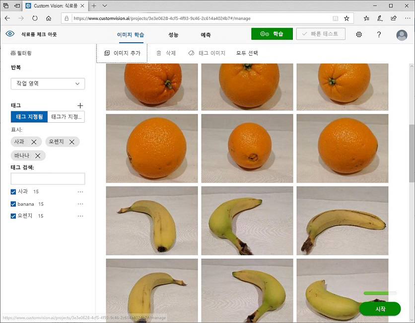
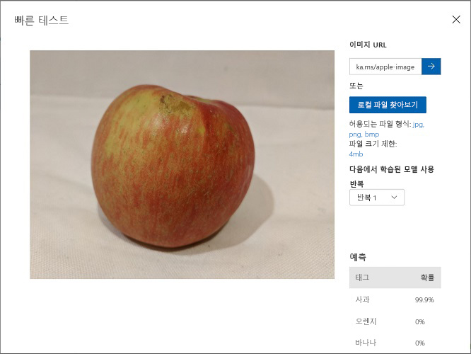

---
lab:
  title: Custom Vision을 사용하여 이미지 분류
  module: Module 9 - Developing Custom Vision Solutions
---

# <a name="classify-images-with-custom-vision"></a>Custom Vision을 사용하여 이미지 분류

The <bpt id="p1">**</bpt>Custom Vision<ept id="p1">**</ept> service enables you to create computer vision models that are trained on your own images. You can use it to train <bpt id="p1">*</bpt>image classification<ept id="p1">*</ept> and <bpt id="p2">*</bpt>object detection<ept id="p2">*</ept> models; which you can then publish and consume from applications.

이 연습에서는 Custom Vision 서비스를 사용하여 이미지에서 3가지 과일 클래스(사과, 바나나, 오렌지)을 식별할 수 있는 이미지 분류 모델을 학습시킵니다.

## <a name="clone-the-repository-for-this-course"></a>이 과정용 리포지토리 복제

If you have not already cloned <bpt id="p1">**</bpt>AI-102-AIEngineer<ept id="p1">**</ept> code repository to the environment where you're working on this lab, follow these steps to do so. Otherwise, open the cloned folder in Visual Studio Code.

1. Visual Studio Code를 시작합니다.
2. 팔레트를 열고(Shift+Ctrl+P) **Git: Clone** 명령을 실행하여 `https://github.com/MicrosoftLearning/AI-102-AIEngineer` 리포지토리를 로컬 폴더(아무 폴더나 관계없음)에 복제합니다.
3. 리포지토리가 복제되면 Visual Studio Code에서 폴더를 엽니다.
4. 리포지토리의 C# 코드 프로젝트를 지원하는 추가 파일이 설치되는 동안 기다립니다.

    > **참고**: 빌드 및 디버그에 필요한 자산을 추가하라는 메시지가 표시되면 **나중에**를 선택합니다.

## <a name="create-custom-vision-resources"></a>Custom Vision 리소스 만들기

Before you can train a model, you will need Azure resources for <bpt id="p1">*</bpt>training<ept id="p1">*</ept> and <bpt id="p2">*</bpt>prediction<ept id="p2">*</ept>. You can create <bpt id="p1">**</bpt>Custom Vision<ept id="p1">**</ept> resources for each of these tasks, or you can create a single <bpt id="p2">**</bpt>Cognitive Services<ept id="p2">**</ept> resource and use it for either (or both).

이 연습에서는 학습 및 예측용 **Custom Vision** 리소스를 만듭니다. 그러면 이러한 워크로드의 액세스 및 비용을 각기 별도로 관리할 수 있습니다.

1. 새 브라우저 탭에서 `https://portal.azure.com`의 Azure Portal을 열고 Azure 구독과 연관된 Microsoft 계정을 사용하여 로그인합니다.
2. **&#65291;리소스 만들기** 단추를 선택하고 *custom vision*을 검색한 후에 다음 설정을 사용하여 **Custom Vision** 리소스를 만듭니다.
    - **만들기 옵션**: 모두
    - **구독**: ‘Azure 구독’
    - **리소스 그룹**: 리소스 그룹 선택 또는 만들기(제한된 구독을 사용 중이라면 새 리소스 그룹을 만들 권한이 없을 수도 있으므로 제공된 리소스 그룹 사용)
    - **지역**: 사용 가능한 지역을 선택합니다.
    - **이름**: *고유 이름 입력*
    - **학습 가격 책정 계층**: F0
    - **예측 가격 책정 계층**: F0

    > **참고**: 구독에 F0 Custom Vision 서비스가 이미 있는 경우에는 해당 서비스에 대해 **S0**을 선택합니다.

3. **Custom Vision** 서비스에서는 고유한 이미지로 학습시킬 수 있는 Computer Vision 모델을 만들 수 있습니다.

> 즉, 이 서비스에서는 *이미지 분류* 및 *개체 감지* 모델을 학습시킨 다음 게시하여 애플리케이션에서 사용할 수 있습니다.

## <a name="create-a-custom-vision-project"></a>Custom Vision 프로젝트 만들기

To train an image classification model, you need to create a Custom Vision project based on your training resource. To do this, you'll use the Custom Vision portal.

1. In Visual Studio Code, view the training images in the <bpt id="p1">**</bpt>17-image-classification/training-images<ept id="p1">**</ept> folder where you cloned the repository. This folder contains subfolders of apple, banana, and orange images.
2. In a new browser tab, open the Custom Vision portal at <ph id="ph1">`https://customvision.ai`</ph>. If prompted, sign in using the Microsoft account associated with your Azure subscription and agree to the terms of service.
3. Custom Vision 포털에서 다음 설정을 사용하여 새 프로젝트를 만듭니다.
    - **이름**: Classify Fruit
    - **설명**: Image classification for fruit
    - **리소스**: 이전에 만든 Custom Vision 리소스
    - **프로젝트 형식**: 분류
    - **분류 형식**: 다중 클래스(이미지당 단일 태그)
    - **도메인**: 식품
4. 이 랩에서 작업을 수행 중인 환경에 **AI-102-AIEngineer** 코드 리포지토리를 아직 복제하지 않았다면 다음 단계에 따라 리포지토리를 지금 복제합니다.


   
5. 이전 단계를 반복하여 태그 *banana*를 지정하여 **banana** 폴더에 이미지를 업로드하고 태그 *orange*를 지정하여 **orange** 폴더에 이미지를 업로드합니다.
6. Custom Vision 프로젝트에서 업로드한 이미지를 살펴봅니다. 다음과 같이 각 클래스에 15개 이미지가 있습니다.


    
7. 리포지토리를 복제한 경우에는 Visual Studio Code에서 복제한 폴더를 엽니다.
8. 모델 반복을 학습시킨 후에는 정밀도, 재현율 및 *AP* 성능 메트릭을 검토합니다. 이러한 메트릭은 분류 모델의 예측 정확도를 측정하며 모두 높게 나타납니다.

> <bpt id="p1">**</bpt>Note<ept id="p1">**</ept>: The performance metrics are based on a probability threshold of 50% for each prediction (in other words, if the model calculates a 50% or higher probability that an image is of a particular class, then that class is predicted). You can adjust this at the top-left of the page.

## <a name="test-the-model"></a>모델 테스트

이제 모델이 학습되었으므로 모델을 테스트할 수 있습니다.

1. 성능 메트릭 위에 있는 **빠른 테스트**를 클릭합니다.
2. **이미지 URL** 상자에 `https://aka.ms/apple-image`를 입력하고 &#10132;를 클릭합니다.
3. 모델에서 반환된 예측 보기 - 다음과 같이 *apple*의 확률 점수가 가장 높습니다.



4. **빠른 테스트** 창을 닫습니다.

## <a name="view-the-project-settings"></a>프로젝트 설정 확인

여기서 만든 프로젝트에는 고유 식별자가 할당되었습니다. 프로젝트와 상호 작용하는 코드에서 이 식별자를 지정해야 합니다.

1. **성능** 페이지 오른쪽 위에 있는 *설정*(&#9881;) 아이콘을 클릭하여 프로젝트 설정을 표시합니다.
2. **일반**(왼쪽에 있음) 아래에서 이 프로젝트를 고유하게 식별하는 **프로젝트 ID**를 확인합니다.
3. On the right, under <bpt id="p1">**</bpt>Resources<ept id="p1">**</ept> note that the key and endpoint are shown. These are the details for the <bpt id="p1">*</bpt>training<ept id="p1">*</ept> resource (you can also obtain this information by viewing the resource in the Azure portal).

## <a name="use-the-training-api"></a>*교육* API 사용

The Custom Vision portal provides a convenient user interface that you can use to upload and tag images, and train models. However, in some scenarios you may want to automate model training by using the Custom Vision training API.

> <bpt id="p1">**</bpt>Note<ept id="p1">**</ept>: In this exercise, you can choose to use the API from either the <bpt id="p2">**</bpt>C#<ept id="p2">**</ept> or <bpt id="p3">**</bpt>Python<ept id="p3">**</ept> SDK. In the steps below, perform the actions appropriate for your preferred language.

1. Visual Studio Code의 **탐색기** 창에서 **17-image_classification** 폴더를 찾은 다음 언어 기본 설정에 따라 **C-Sharp** 또는 **Python** 폴더를 확장합니다.
2. Right-click the <bpt id="p1">**</bpt>train-classifier<ept id="p1">**</ept> folder and open an integrated terminal. Then install the Custom Vision Training package by running the appropriate command for your language preference:

**C#**

```
dotnet add package Microsoft.Azure.CognitiveServices.Vision.CustomVision.Training --version 2.0.0
```

**Python**

```
pip install azure-cognitiveservices-vision-customvision==3.1.0
```

3. **train-classifier** 폴더의 내용을 표시하여 구성 설정용 파일이 포함되어 있음을 확인합니다.
    - **C#** : appsettings.json
    - **Python**: .env

    Open the configuration file and update the configuration values it contains to reflect the endpoint and key for your Custom Vision <bpt id="p1">*</bpt>training<ept id="p1">*</ept> resource, and the project ID for the classification project you created previously. Save your changes.
4. **train-classifier** 폴더에는 클라이언트 애플리케이션용 코드 파일이 포함되어 있습니다.

    - **C#** : Program.cs
    - **Python**: train-classifier.py

    코드 파일을 열고 포함되어 있는 코드를 검토하여 다음 세부 정보를 확인합니다.
    - 설치한 패키지의 네임스페이스를 가져왔습니다.
    - **Main** 함수가 구성 설정을 검색하며 키와 엔드포인트를 사용하여 인증된 **CustomVisionTrainingClient**를 만듭니다. 이 CustomVisionTrainingClient와 프로젝트 ID를 사용하여 프로젝트에 대한 **Project** 참조를 만듭니다.
    - **Upload_Images** 함수가 Custom Vision 프로젝트에 정의된 태그를 검색한 다음 해당 이름이 지정된 폴더의 이미지를 프로젝트에 업로드하고 적절한 태그 ID를 할당합니다.
    - **Train_Model** 함수가 프로젝트용으로 새 학습 반복을 만들고 학습이 완료될 때까지 기다립니다.
5. **train-classifier** 폴더의 통합 터미널로 돌아와서 다음 명령을 입력하여 프로그램을 실행합니다.

**C#**

```
dotnet run
```

**Python**

```
python train-classifier.py
```
    
6. Wait for the program to end. Then return to your browser and view the <bpt id="p1">**</bpt>Training Images<ept id="p1">**</ept> page for your project in the Custom Vision portal (refreshing the browser if necessary).
7. 모델을 학습시키려면 *학습* 및 *예측*용 Azure 리소스가 필요합니다.

## <a name="publish-the-image-classification-model"></a>이미지 분류 모델 게시

이제 클라이언트 애플리케이션에서 사용하도록 학습된 모델을 게시할 수 있습니다.

1. Custom Vision 포털의 **성능** 페이지에서 **&#128504; 게시**를 클릭하여 다음 설정을 사용해 학습시킨 모델을 게시합니다.
    - **모델 이름**: fruit-classifier
    - **예측 리소스**: 이전에 만든 **예측** “-Prediction”으로 끝나는 리소스(학습 리소스 <u>아님</u>)
2. **프로젝트 설정** 페이지 왼쪽 위에서 *프로젝트 설정*(&#128065;) 아이콘을 클릭하여 Custom Vision 포털 홈 페이지로 돌아옵니다. 이제 홈 페이지에 프로젝트가 나열됩니다.
3. 이러한 각 작업용으로 **Custom Vision** 리소스를 만들 수도 있고 **Cognitive Services** 리소스 하나를 만든 다음 두 작업 중 하나(또는 두 작업 모두)에 사용할 수 있습니다.

## <a name="use-the-image-classifier-from-a-client-application"></a>클라이언트 애플리케이션에서 이미지 분류자 사용

Now that you've published the image classification model, you can use it from a client application. Once again, you can choose to use <bpt id="p1">**</bpt>C#<ept id="p1">**</ept> or <bpt id="p2">**</bpt>Python<ept id="p2">**</ept>.

1. In Visual Studio Code, in the <bpt id="p1">**</bpt>17-image-classification<ept id="p1">**</ept> folder, in the subfolder for your preferred language (<bpt id="p2">**</bpt>C-Sharp<ept id="p2">**</ept> or <bpt id="p3">**</bpt>Python<ept id="p3">**</ept>), right- the <bpt id="p4">**</bpt>test-classifier<ept id="p4">**</ept> folder and open an integrated terminal. Then enter the following SDK-specific command to install the Custom Vision Prediction package:

**C#**

```
dotnet add package Microsoft.Azure.CognitiveServices.Vision.CustomVision.Prediction --version 2.0.0
```

**Python**

```
pip install azure-cognitiveservices-vision-customvision==3.1.0
```

> **참고**: Python SDK 패키지에는 학습 패키지와 예측 패키지가 모두 포함되어 있으며, 이러한 패키지가 이미 설치되어 있을 수도 있습니다.

2. **test-classifier** 폴더를 확장하여 이 폴더에 포함되어 있는 파일을 확인합니다. 이러한 파일은 이미지 분류 모델용 테스트 클라이언트 애플리케이션을 구현하는 데 사용됩니다.
3. Open the configuration file for your client application (<bpt id="p1">*</bpt>appsettings.json<ept id="p1">*</ept> for C# or <bpt id="p2">*</bpt>.env<ept id="p2">*</ept> for Python) and update the configuration values it contains to reflect the endpoint and key for your Custom Vision <bpt id="p3">*</bpt>prediction<ept id="p3">*</ept> resource, the project ID for the classification project, and the name of your published model (which should be <bpt id="p4">*</bpt>fruit-classifier<ept id="p4">*</ept>). Save your changes.
4. 클라이언트 애플리케이션의 코드 파일(C#의 경우 *Program.cs*, Python의 경우 *test-classification.py*)을 열고 포함되어 있는 코드를 검토하여 다음 세부 정보를 확인합니다.
    - 설치한 패키지의 네임스페이스를 가져왔습니다.
    - **Main** 함수가 구성 설정을 검색하며 키와 엔드포인트를 사용하여 인증된 **CustomVisionPredictionClient**를 만듭니다.
    - The prediction client object is used to predict a class for each image in the <bpt id="p1">**</bpt>test-images<ept id="p1">**</ept> folder, specifying the project ID and model name for each request. Each prediction includes a probability for each possible class, and only predicted tags with a probability greater than 50% are displayed.
5. **test-classifier** 폴더의 통합 터미널로 돌아와서 다음의 SDK별 명령을 입력하여 프로그램을 실행합니다.

**C#**

```
dotnet run
```

**Python**

```
python test-classifier.py
```

6. View the label (tag) and probability scores for each prediction. You can view the images in the <bpt id="p1">**</bpt>test-images<ept id="p1">**</ept> folder to verify that the model has classified them correctly.

## <a name="more-information"></a>추가 정보

Custom Vision 서비스를 통한 이미지 분류에 대한 자세한 내용은 [Custom Vision 설명서](https://docs.microsoft.com/azure/cognitive-services/custom-vision-service/)를 참조하세요.
