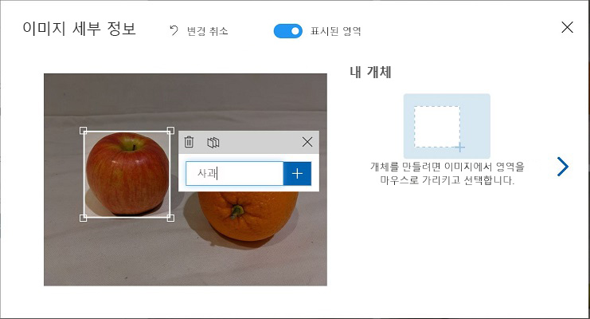
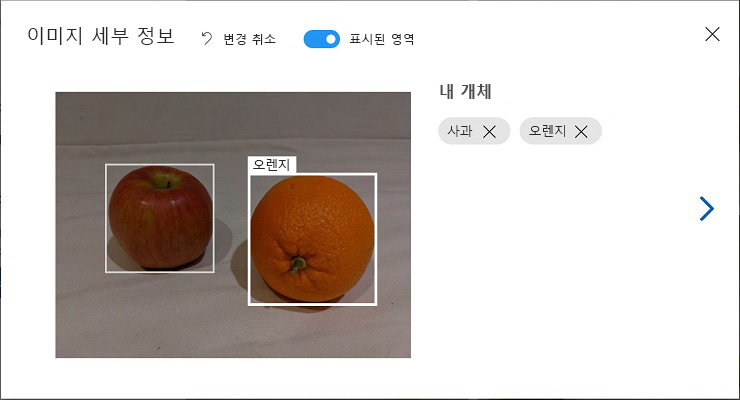
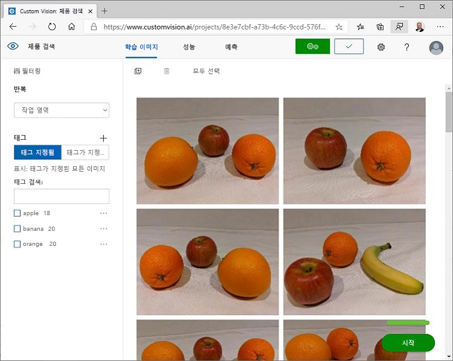

---
lab:
    title: 'Custom Vision을 사용하여 이미지의 개체 감지'
    module: '모듈 9 - Custom Vision 솔루션 개발'
---

# Custom Vision을 사용하여 이미지의 개체 감지

이 연습에서는 Custom Vision 서비스를 사용하여 이미지에서 3가지 과일 클래스(사과, 바나나, 오렌지)을 감지하고 찾을 수 있는 *개체 감지* 모델을 학습시킵니다.

## 이 과정용 리포지토리 복제

이 랩에서 작업을 수행 중인 환경에 **AI-102-AIEngineer** 코드 리포지토리를 이미 복제했다면 Visual Studio Code에서 해당 리포지토리를 열고, 그렇지 않으면 다음 단계에 따라 리포지토리를 지금 복제합니다.

1. Visual Studio Code를 시작합니다.
2. 팔레트를 열고(Shift+Ctrl+P 누르기) **Git: Clone** 명령을 실행하여 `https://github.com/MicrosoftLearning/AI-102KO-Designing-and-Implementing-a-Microsoft-Azure-AI-Solution` 리포지토리를 로컬 폴더(아무 폴더나 관계없음)에 복제합니다.
3. 리포지토리가 복제되면 Visual Studio Code에서 폴더를 엽니다.
4. 리포지토리의 C# 코드 프로젝트를 지원하는 추가 파일이 설치되는 동안 기다립니다.

    > **참고**: 빌드 및 디버그에 필요한 자산을 추가하라는 메시지가 표시되면 **나중에**를 선택합니다.

## Custom Vision 리소스 만들기

Azure 구독에 학습 및 예측용 **Custom Vision** 리소스가 이미 포함되어 있으면 이 연습에서 해당 리소스를 사용할 수 있습니다. 그렇지 않은 경우에는 다음 지침에 따라 해당 리소스를 만듭니다.

1. 새 브라우저 탭에서 Azure Portal `https://portal.azure.com`을 열고 Azure 구독과 연결된 Microsoft 계정을 사용하여 로그인합니다.
2. **&#65291;리소스 만들기** 단추를 선택하고 *custom vision*을 검색한 후에 다음 설정을 사용하여 **Custom Vision** 리소스를 만듭니다.
    - **만들기 옵션**: 모두
    - **구독**: *사용자의 Azure 구독*
    - **리소스 그룹**: *리소스 그룹 선택 또는 만들기(제한된 구독을 사용 중이라면 새 리소스 그룹을 만들 권한이 없을 수도 있으므로 제공된 리소스 그룹 사용)*
    - **이름**: *고유한 이름 입력*
    - **학습 위치**: *사용 가능한 아무 지역이나 선택*
    - **학습 가격 책정 계층**: F0
    - **예측 위치**: *학습 리소스와 같은 지역*
    - **예측 가격 책정 계층**: F0

    > **참고**: 구독에 F0 Custom Vision 서비스가 이미 포함되어 있으면 여기서는 **S0**을 선택합니다.

3. 리소스가 작성될 때까지 기다렸다가 배포 세부 정보를 표시하여 학습과 예측용으로 Custom Vision 리소스가 하나씩 프로비전되었는지 확인합니다. 리소스를 만든 리소스 그룹으로 이동하면 이러한 리소스를 확인할 수 있습니다.

> **중요**: 각 리소스에는 자체 *엔드포인트* 및 *키*가 있습니다. 엔드포인트와 키는 코드에서 액세스를 관리하는 데 사용됩니다. 이미지 분류 모델을 학습시키려면 코드가 *학습* 리소스(해당 엔드포인트와 키 포함)를 사용해야 합니다. 그리고 학습된 모델을 사용하여 이미지 클래스를 예측하려면 코드가 *예측* 리소스(해당 엔드포인트와 키 포함)를 사용해야 합니다.

## Custom Vision 프로젝트 만들기

개체 감지 모델을 학습시키려면 학습 리소스를 기반으로 Custom Vision 프로젝트를 만들어야 합니다. 이 프로젝트를 만들려면 Custom Vision 포털을 사용합니다.

1. 새 브라우저 탭에서 Custom Vision 포털 `https://customvision.ai`를 열고 Azure 구독과 연결된 Microsoft 계정을 사용하여 로그인합니다.
2. 다음 설정을 사용하여 새 프로젝트를 만듭니다.
    - **이름**: Detect Fruit
    - **설명**: Object detection for fruit.
    - **리소스**: *이전에 만든 Custom Vision 리소스*
    - **프로젝트 형식**: 개체 감지
    - **도메인**: 일반
3. 프로젝트가 작성될 때까지 기다렸다가 브라우저에서 프로젝트를 엽니다.

## 이미지 추가 및 태그 지정

개체 감지 모델을 학습시키려면 모델이 식별하도록 할 클래스가 포함된 이미지를 업로드하고 각 개체 인스턴스의 경계 상자를 나타내는 태그를 지정해야 합니다.

1. Visual Studio Code에서 리포지토리를 복제한 **18-object-detection/training-images** 폴더의 학습 이미지를 확인합니다. 이 폴더에는 과일 이미지가 포함되어 있습니다.
2. Custom Vision 포털의 개체 감지 프로젝트에서 **이미지 추가**를 선택하고 추출한 폴더의 모든 이미지를 업로드합니다.
3. 이미지가 업로드되고 나면 첫 번째 이미지를 선택하여 엽니다.
4. 아래 이미지와 같이 자동 감지된 영역이 표시될 때까지 이미지의 개체를 마우스로 가리킵니다. 그런 다음 개체를 선택하고 필요한 경우 개체가 포함되도록 영역 크기를 조정합니다.


개체 주위를 끌어 영역을 만들 수도 있습니다.

5. 개체가 영역 내에 포함되면 아래에 나와 있는 것처럼 적절한 개체 유형(*apple*, *banana* 또는 *orange*)으로 새 태그를 추가합니다.



6. 이미지에 포함된 다른 개체를 각각 선택하여 태그를 지정합니다. 필요에 따라 영역 크기를 조정하고 새 태그를 추가합니다.



7. 오른쪽의 **>** 링크를 사용하여 다음 이미지로 이동한 후에 개체 태그를 지정합니다. 그런 후에 전체 이미지 컬렉션에서 같은 작업을 계속 진행하여 사과, 바나나, 오렌지에 각각 태그를 지정합니다.

8. 마지막 이미지까지 태그를 모두 지정했으면 **이미지 세부 정보** 편집기를 닫고 **학습 이미지** 페이지의 **태그** 아래에서 **태그 지정**을 선택하여 태그가 지정된 이미지를 모두 확인합니다.



## 교육 API를 사용하여 이미지 업로드

Custom Vision 포털의 그래픽 도구를 사용하여 이미지에 태그를 지정할 수도 있지만, 대다수 AI 개발 팀은 이미지의 개체 영역 및 태그 관련 정보가 포함된 파일을 생성하는 다른 도구를 사용합니다. 이러한 시나리오에서는 Custom Vision 교육 API를 사용하여 프로젝트에 태그가 지정된 이미지를 업로드할 수 있습니다.

> **참고**: 이 연습에서는 **C#** 또는 **Python** SDK의 API 사용을 선택할 수 있습니다. 아래 단계에서 선호하는 언어에 적합한 작업을 수행하세요.

1. Custom Vision 포털의 **학습 이미지** 페이지 오른쪽 위에 있는 *설정*(&#9881;) 아이콘을 클릭하여 프로젝트 설정을 표시합니다.
2. **일반**(왼쪽에 있음) 아래에서 이 프로젝트를 고유하게 식별하는 **프로젝트 ID**를 확인합니다.
3. 오른쪽의 **리소스** 아래에는 *학습* 리소스의 키와 엔드포인트를 포함한 세부 정보가 표시됩니다(Azure Portal에서 리소스를 표시해도 이 정보를 확인할 수 있음).
4. Visual Studio Code의 **18-object-detection** 폴더 아래에서 언어 기본 설정에 따라 **C-Sharp** 또는 **Python** 폴더를 확장합니다.
5. **train-detector** 폴더를 마우스 오른쪽 단추로 클릭하고 통합 터미널을 엽니다. 그런 다음 언어 기본 설정에 적합한 명령을 실행하여 Custom Vision 학습 패키지를 설치합니다.

**C#**

```
dotnet add package Microsoft.Azure.CognitiveServices.Vision.CustomVision.Training --version 2.0.0
```

**Python**

```
pip install azure-cognitiveservices-vision-customvision==3.1.0
```

6. **train-detector** 폴더의 내용을 표시하여 구성 설정용 파일이 포함되어 있음을 확인합니다.
    - **C#**: appsettings.json
    - **Python**: .env

    구성 파일을 열고 Custom Vision *학습* 리소스의 엔드포인트와 키, 그리고 이전에 만든 분류 프로젝트의 프로젝트 ID를 반영하여 해당 파일에 포함된 구성 값을 업데이트합니다. 변경 내용을 저장합니다.

7. **train-detector** 폴더에서 **tagged-images.json**을 열고 해당 파일에 포함된 JSON을 살펴봅니다. 이 JSON은 태그가 지정된 영역이 하나 이상 포함된 이미지 목록을 정의합니다. 태그가 지정된 각 영역에는 태그 이름, 그리고 태그가 지정된 개체가 들어 있는 경계 상자의 위쪽 및 왼쪽 좌표와 너비 및 높이 치수가 포함되어 있습니다.

    > **참고**: 이 파일의 좌표 및 치수는 이미지의 상대 지점을 나타냅니다. 예를 들어 *높이* 값이 0.7이면 상자 위치가 이미지 높이의 70%라는 의미입니다. 다른 파일 형식을 생성하는 태그 지정 도구도 있습니다. 가령 좌표 및 치수 값이 픽셀, 인치 또는 기타 측정 단위를 나타낼 수도 있습니다.

8. **train-detector** 폴더에 포함된 하위 폴더에는 JSON 파일에서 참조된 이미지 파일이 저장되어 있습니다.


9. **train-detector** 폴더에는 클라이언트 애플리케이션용 코드 파일이 포함되어 있습니다.

    - **C#**: Program.cs
    - **Python**: train-detector.py

    코드 파일을 열고 포함되어 있는 코드를 검토하여 다음 세부 정보를 확인합니다.
    - 설치한 패키지의 네임스페이스를 가져왔습니다.
    - **Main** 함수가 구성 설정을 검색하며 키와 엔드포인트를 사용하여 인증된 **CustomVisionTrainingClient**를 만듭니다. 이 CustomVisionTrainingClient와 프로젝트 ID를 사용하여 프로젝트에 대한 **Project** 참조를 만듭니다.
    - **Upload_Images** 함수가 JSON 파일에서 태그가 지정된 영역 정보를 추출하고, 해당 정보를 사용하여 영역이 포함된 이미지 배치를 만든 후 프로젝트에 해당 배치를 업로드합니다.
10. **train-detector** 폴더의 통합 터미널로 돌아와서 다음 명령을 입력하여 프로그램을 실행합니다.
    
**C#**

```
dotnet run
```

**Python**

```
python train-detector.py
```
    
11. 프로그램이 종료될 때까지 기다립니다. 그런 다음 브라우저로 돌아와 Custom Vision 포털에서 프로젝트의 **학습 이미지** 페이지를 확인합니다(필요한 경우 브라우저를 새로 고침).
12. 새로 태그가 지정된 이미지 몇 개가 프로젝트에 추가되었음을 확인합니다.

## 모델 학습 및 테스트

프로젝트에서 이미지에 태그를 지정했으므로 모델을 학습시킬 수 있습니다.

1. Custom Vision 프로젝트에서 **학습**을 클릭하여 태그가 지정된 이미지를 사용해 개체 감지 모델을 학습시킵니다. **빠른 학습** 옵션을 선택합니다.
2. 학습이 완료될 때까지 기다렸다가(10분 정도 걸릴 수 있음) *정밀도*, *재현율* 및 *mAP* 성능 메트릭을 검토합니다. 분류 모델의 예측 정확도를 측정하는 이러한 메트릭이 모두 높은 값으로 표시되어야 합니다.
3. 페이지 오른쪽 위에서 **빠른 테스트**를 클릭하고 **이미지 URL** 상자에 `https://aka.ms/apple-orange`를 입력한 후에 생성되는 예측을 확인합니다. 그런 다음 **빠른 테스트** 창을 닫습니다.

## 개체 감지 모델 게시

이제 클라이언트 애플리케이션에서 사용하도록 학습된 모델을 게시할 수 있습니다.

1. Custom Vision 포털의 **성능** 페이지에서 **&#128504; 게시**를 클릭하여 다음 설정을 사용해 학습시킨 모델을 게시합니다.
    - **모델 이름**: fruit-detector
    - **예측 리소스**: *이전에 만든 **예측** 리소스(학습 리소스 <u>아님</u>)*
2. **프로젝트 설정** 페이지 왼쪽 위에서 **프로젝트 설정**(&#128065;) 아이콘을 클릭하여 Custom Vision 포털 홈 페이지로 돌아옵니다. 이제 홈 페이지에 프로젝트가 나열됩니다.
3. Custom Vision 포털 홈 페이지 오른쪽 위의 *설정*(&#9881;) 아이콘을 클릭하여 Custom Vision 서비스의 설정을 확인합니다. 그런 다음 **리소스** 아래에서 *예측* 리소스(학습 리소스 <u>아님</u>)를 찾아 **키** 및 **엔드포인트** 값을 확인합니다(Azure Portal에서 리소스를 표시해도 이 정보를 확인할 수 있음).

## 클라이언트 애플리케이션에서 이미지 분류자 사용

이미지 분류 모델을 게시했으므로 클라이언트 애플리케이션에서 해당 모델을 사용할 수 있습니다. 이번에도 **C#** 또는 **Python** 사용을 선택할 수 있습니다.

1. Visual Studio Code에서 **18-object-detection** 폴더로 이동한 다음 선호하는 언어(**C-Sharp** 또는 **Python**)에 해당하는 폴더에서 **test-detector** 폴더를 확장합니다.
2. **test-detector** 폴더를 마우스 오른쪽 단추로 클릭하고 통합 터미널을 엽니다. 그런 후에 다음 SDK별 명령을 입력하여 Custom Vision Prediction 패키지를 설치합니다.

**C#**

```
dotnet add package Microsoft.Azure.CognitiveServices.Vision.CustomVision.Prediction --version 2.0.0
```

**Python**

```
pip install azure-cognitiveservices-vision-customvision==3.1.0
```

> **참고**: Python SDK 패키지에는 학습 패키지와 예측 패키지가 모두 포함되어 있으며, 이러한 패키지가 이미 설치되어 있을 수도 있습니다.

3. 클라이언트 애플리케이션용 구성 파일(C#의 경우 *appsettings.json*, Python의 경우 *env*)을 열고 Custom Vision *예측* 리소스의 엔드포인트와 키, 개체 감지 프로젝트의 프로젝트 ID, 그리고 게시한 모델의 이름(*fruit-detector*)을 반영하여 해당 파일에 포함된 구성 값을 업데이트합니다. 변경 내용을 저장합니다.
4. 클라이언트 애플리케이션의 코드 파일(C#의 경우 *Program.cs*, Python의 경우 *test-detector.py*)을 열고 포함되어 있는 코드를 검토하여 다음 세부 정보를 확인합니다.
    - 설치한 패키지의 네임스페이스를 가져왔습니다.
    - **Main** 함수가 구성 설정을 검색하며 키와 엔드포인트를 사용하여 인증된 **CustomVisionPredictionClient**를 만듭니다.
    - 예측 클라이언트 개체를 사용하여 요청에서 프로젝트 ID와 모델 이름을 지정해 **produce.jpg** 이미지에 대한 개체 감지 예측을 가져옵니다. 이미지에서 예측된 태그 지정 영역을 그리고 결과를 **recognized_faces.jpg**로 저장합니다.
5. **test-detector** 폴더의 통합 터미널로 돌아와서 다음 명령을 입력하여 프로그램을 실행합니다.

**C#**

```
dotnet run
```

**Python**

```
python test-detector.py
```

6. 프로그램 실행이 완료되면 생성된 **output.jpg** 파일을 표시하여 이미지에서 감지된 개체를 확인합니다.

## 자세한 정보

Custom Vision 서비스를 통한 개체 감지에 대한 자세한 내용은 [Custom Vision 설명서](https://docs.microsoft.com/azure/cognitive-services/custom-vision-service/)를 참조하세요.
