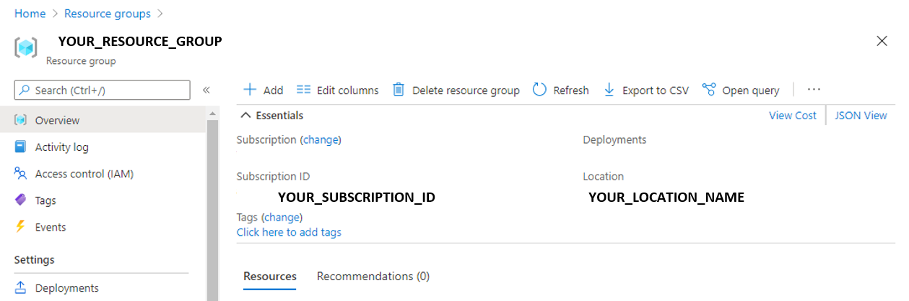

---
lab:
    title: '양식에서 데이터 추출'
    module: '모듈 11 - 이미지 및 문서에서 텍스트 읽기'
---

# 양식에서 데이터 추출 

데이터 입력 프로세스를 자동화해야 하는 회사가 있다고 가정해 보겠습니다. 현재는 한 직원이 구매 주문을 직접 읽은 후 데이터베이스에 데이터를 입력하고 있습니다. 기계 학습을 사용해 양식을 읽은 다음 데이터베이스 자동 업데이트에 사용할 수 있는 구조적 데이터를 생성하는 모델을 빌드하려고 합니다.

사용자가 자동화된 데이터 처리 소프트웨어를 빌드하는 데 사용할 수 있는 Cognitive Service는 **Form Recognizer**입니다. 이 소프트웨어는 OCR(광학 인식) 기술을 사용해 양식 문서에서 텍스트, 키/값 쌍 및 테이블을 추출할 수 있습니다. Form Recognizer에는 송장, 영수증 및 명함 인식용으로 미리 빌드된 모델이 포함되어 있습니다. 이 서비스에서는 사용자 지정 모델을 학습시키는 기능도 제공합니다. 이 연습에서는 사용자 지정 모델 빌드 과정을 중점적으로 진행합니다.

## 이 과정용 리포지토리 복제

이 과정용 코드 리포지토리를 아직 복제하지 않았으면 복제해야 합니다.

1. Visual Studio Code를 시작합니다.
2. 팔레트를 열고(Shift+Ctrl+P 누르기) **Git: Clone** 명령을 실행하여 `https://github.com/MicrosoftLearning/AI-102KO-Designing-and-Implementing-a-Microsoft-Azure-AI-Solution` 리포지토리를 로컬 폴더(아무 폴더나 관계없음)에 복제합니다.
3. 리포지토리가 복제되면 Visual Studio Code에서 폴더를 엽니다.
4. 리포지토리의 C# 코드 프로젝트를 지원하는 추가 파일이 설치되는 동안 기다립니다.

    > **참고**: 빌드 및 디버그에 필요한 자산을 추가하라는 메시지가 표시되면 **나중에**를 선택합니다.

## Form Recognizer 리소스 만들기

Form Recognizer 서비스를 사용하려면 Azure 구독의 Form Recognizer 리소스가 필요합니다. 여기서는 Azure Portal을 사용하여 리소스를 만듭니다.

1.  Azure Portal `https://portal.azure.com`을 열고 Azure 구독과 연결된 Microsoft 계정을 사용하여 로그인합니다.

2. **&#65291;리소스 만들기** 단추를 선택하고 *Form Recognizer*를 검색한 후에 다음 설정을 사용하여 **Form Recognizer** 리소스를 만듭니다.
    - **구독**: *사용자의 Azure 구독*
    - **리소스 그룹**: *리소스 그룹 선택 또는 만들기(제한된 구독을 사용 중이라면 새 리소스 그룹을 만들 권한이 없을 수도 있으므로 제공된 리소스 그룹 사용)*
    - **지역**: *사용 가능한 아무 지역이나 선택*
    - **이름**: *고유한 이름 입력*
    - **가격 책정 계층**: F0

    > **참고**: 구독에 F0 Form Recognizer 서비스가 이미 포함되어 있으면 여기서는 **S0**을 선택합니다.

3. 리소스가 배포되면 해당 리소스로 이동하여 **키 및 엔드포인트** 페이지를 확인합니다. 나중에 코드에서 액세스를 관리하려면 이 페이지에 표시되는 **키** 중 하나와 **엔드포인트**가 필요합니다. 

## 학습용 문서 수집

  

이후 작업에서는 이 리포지토리의 **21-custom-form/sample-forms** 폴더에 포함된 샘플 양식을 사용합니다. 이러한 양식에는 레이블을 사용하지 않고 모델 하나를 학습시키고, 레이블을 사용하여 다른 모델을 학습시키는 데 필요한 모든 파일이 포함되어 있습니다.

1. Visual Studio Code의 **21-custom-form** 폴더에서 **sample-forms** 폴더를 확장합니다. 이 폴더에는 이름이 **json** 및 **jpg**로 끝나는 파일이 여러 개 있습니다.

    여기서는 **jpg** 파일을 사용해 레이블 _없이_ 첫 번째 모델을 학습시킵니다.  

    뒷부분에서는 이름이 **json** 및 **jpg**로 끝나는 파일을 사용해 레이블을 **포함**하여 두 번째 모델을 학습시킵니다. 자동으로 생성된 **json** 파일에는 레이블 정보가 포함되어 있습니다. 레이블을 사용하여 모델을 학습시키려면 양식과는 별도로 Blob Storage 컨테이너에 레이블 정보 파일이 있어야 합니다. 

2. Azure Portal [https://portal.azure.com](https://portal.azure.com)으로 돌아옵니다.

3. 이전에 Form Recognizer 리소스를 만든 **리소스 그룹**을 표시합니다.

4. 리소스 그룹의 **개요** 페이지에서 **구독 ID** 및 **위치**를 확인합니다. 후속 단계에서 이러한 값과 **리소스 그룹** 이름이 필요합니다.



5. Visual Studio Code의 탐색기 창에서 **21-custom-form** 폴더를 마우스 오른쪽 단추로 클릭하고 **통합 터미널에서 열기**를 선택합니다.

6. 터미널 창에 다음 명령을 입력하여 Azure 구독에 대한 인증된 연결을 설정합니다.
    
```
az login --output none
```

7. 메시지가 표시되면 Azure 구독에 로그인합니다. 그런 다음 Visual Studio Code로 돌아와서 로그인 프로세스가 완료될 때까지 기다립니다.

8. 다음 명령을 실행하여 Azure 위치를 나열합니다.

```
az account list-locations -o table
```

9. 출력에서 리소스 그룹 위치에 해당하는 **Name** 값을 찾습니다(예를 들어 *미국 동부*에 해당하는 이름은 *eastus*임).

    > **중요**: **Name** 값을 적어 두었다가 12단계에서 사용하세요.

10. 탐색기 창의 **21-custom-form** 폴더에서 **setup.cmd**를 선택합니다. 이 배치 스크립트를 사용하여 필요한 기타 Azure 리소스를 만드는 데 필요한 Azure CLI(명령줄 인터페이스)를 실행합니다.

11. **setup.cmd** 스크립트에서 **rem** 명령을 검토합니다. 이러한 명령에는 스크립트를 실행한 프로그램이 요약되어 있습니다. 프로그램은 다음 작업을 수행합니다. 
    - Azure 리소스 그룹에서 스토리지 계정 만들기
    - 로컬 _sampleforms_ 폴더에서 스토리지 계정의 _sampleforms_ 컨테이너로 파일 업로드
    - 공유 액세스 서명 URI 인쇄

12. Form Recognizer 리소스를 배포한 구독, 리소스 그룹 및 위치 이름에 해당하는 값을 사용하여 **subscription_id**, **resource_group** 및 **location** 변수 선언을 수정합니다. 
그런 다음 변경 내용을 **저장**합니다.

    **expiry_date** 변수의 경우 이 연습에서는 그대로 유지합니다. 이 변수는 SAS(공유 액세스 서명) URI를 생성할 때 사용됩니다. 실제로는 SAS에 적절한 만료 날짜를 설정해야 합니다. [여기](https://docs.microsoft.com/azure/storage/common/storage-sas-overview#how-a-shared-access-signature-works)서 SAS에 대해 자세히 알아볼 수 있습니다.  

13. **21-custom-form** 폴더의 터미널에서 다음 명령을 입력하여 스크립트를 실행합니다.

```
setup
```

14. 스크립트 실행이 완료되면 표시되는 출력을 검토하여 Azure 리소스의 SAS URI를 확인합니다.

> **중요**: 다음 작업을 계속 진행하기 전에 나중에 다시 검색할 수 있는 위치(예: Visual Studio Code의 새 텍스트 파일)에 SAS URI를 붙여넣습니다.

15. Azure Portal에서 리소스 그룹을 새로 고쳐 방금 만든 Azure Storage 계정이 포함되어 있는지 확인합니다. 스토리지 계정을 열고 왼쪽 창에서 **Storage Explorer**를 선택합니다. 그런 다음 Storage Explorer에서 **Blob 컨테이너**를 확장하고 **sampleforms** 컨테이너를 선택하여 로컬 **21-custom-form/sample-forms** 폴더에서 파일이 업로드되었음을 확인합니다.

## 레이블 *없이* 모델 학습시키기

이 작업에서는 Form Recognizer SDK를 사용하여 사용자 지정 모델 학습 및 테스트를 진행합니다.  

> **참고**: 이 연습에서는 **C#** 또는 **Python** SDK의 API 사용을 선택할 수 있습니다. 아래 단계에서 선호하는 언어에 적합한 작업을 수행하세요.

1. Visual Studio Code의 **21-custom-form** 폴더에서 언어 기본 설정에 따라 **C-Sharp** 또는 **Python** 폴더를 확장합니다.
2. **train-model** 폴더를 마우스 오른쪽 단추로 클릭하고 통합 터미널을 엽니다.

3. 언어 기본 설정에 적합한 명령을 실행하여 Form Recognizer 패키지를 설치합니다.

**C#**

```
dotnet add package Azure.AI.FormRecognizer --version 3.0.0 
```

**Python**

```
pip install azure-ai-formrecognizer==3.0.0
```

3. **train-model** 폴더의 내용을 표시하여 구성 설정용 파일이 포함되어 있음을 확인합니다.
    - **C#**: appsettings.json
    - **Python**: .env

4. 구성 파일을 편집하여 다음 항목이 반영되도록 설정을 수정합니다.
    - Form Recognizer 리소스의 **엔드포인트**
    - Form Recognizer 리소스의 **키**
    - Blob 컨테이너의 **SAS URI**

5. **train-model** 폴더에는 클라이언트 애플리케이션용 코드 파일이 포함되어 있습니다.

    - **C#**: Program.cs
    - **Python**: train-model.py

    코드 파일을 열고 포함되어 있는 코드를 검토하여 다음 세부 정보를 확인합니다.
    - 설치한 패키지의 네임스페이스를 가져왔습니다.
    - **Main** 함수가 구성 설정을 검색하며 키와 엔드포인트를 사용하여 인증된 **클라이언트**를 만듭니다.
    - 이 코드는 학습 클라이언트를 사용해 Blob Storage 컨테이너의 이미지로 모델을 학습시킵니다. 앞에서 생성한 SAS URI를 사용하여 이 컨테이너에 액세스할 수 있습니다.
    - 학습은 학습 레이블을 사용하면 <u>안</u> 됨을 나타내는 매개 변수를 사용하여 수행됩니다. Form Recognizer는 *비감독형* 기술을 사용하여 양식 이미지에서 필드를 추출합니다.

6. **train-model** 폴더의 통합 터미널로 돌아와서 다음 명령을 입력하여 프로그램을 실행합니다.

**C#**

```
dotnet run
```

**Python**

```
python train-model.py
```

7. 프로그램이 종료될 때까지 기다립니다. 그런 다음 터미널에서 모델 출력을 검토하여 모델 ID를 찾습니다. 다음 절차에서 이 값이 필요하므로 터미널을 닫지 마세요.

## 레이블 없이 모델 테스트

이제 학습된 모델을 사용할 준비가 되었습니다. 앞에서는 스토리지 컨테이너 URI에서 파일을 사용하여 모델을 학습시켰습니다. 하지만 로컬 파일을 사용했어도 됩니다. 테스트의 경우에도 마찬가지로 URI의 양식을 사용하거나 로컬 파일을 사용할 수 있습니다. 여기서는 로컬 파일을 사용하여 양식 모델을 테스트합니다.

앞에서 모델 ID를 확인했으므로 클라이언트 애플리케이션에서 모델을 사용할 수 있습니다. 이번에도 **C#** 또는 **Python** 사용을 선택할 수 있습니다.

1. **21-custom-form** 폴더 내의 선호하는 언어(**C-Sharp** 또는 **Python**) 하위 폴더에서 **test-model** 폴더를 확장합니다.
2. **test-model** 폴더를 마우스 오른쪽 단추로 클릭하고 통합 터미널을 엽니다. 이제 **cmd** 터미널이 2개(이상) 표시되어 있을 것입니다. 터미널 창의 드롭다운 목록을 사용하면 터미널 간을 전환할 수 있습니다.
3. **test-model** 폴더의 터미널에서 언어 기본 설정에 적합한 명령을 실행하여 Form Recognizer 패키지를 설치합니다.

**C#**

```
dotnet add package Azure.AI.FormRecognizer --version 3.0.0 
```

**Python**

```
pip install azure-ai-formrecognizer==3.0.0
```

*이전에 pip를 사용하여 Python 환경에 패키지를 설치했다면 이 작업을 반드시 수행할 필요는 없습니다. 하지만 이 단계를 수행하면 패키지가 설치되어 있는지를 확인할 수 있습니다.*

4. **test-model** 폴더에서 구성 파일(언어 기본 설정에 따라 **appsettings.json** 또는 **env**)을 편집하여 다음 값을 추가합니다.
    - Form Recognizer 엔드포인트
    - Form Recognizer 키
    - 모델을 학습시킬 때 생성된 모델 ID(**train-model** 폴더의 **cmd** 콘솔로 터미널을 다시 전환하면 이 ID를 확인할 수 있음)

5. **test-model** 폴더에서 클라이언트 애플리케이션의 코드 파일(C#의 경우 *Program.cs*, Python의 경우 *test-model.py*)을 열고 포함되어 있는 코드를 검토하여 다음 세부 정보를 확인합니다.
    - 설치한 패키지의 네임스페이스를 가져왔습니다.
    - **Main** 함수가 구성 설정을 검색하며 키와 엔드포인트를 사용하여 인증된 **클라이언트**를 만듭니다.
    - 클라이언트를 사용하여 **test1.jpg** 이미지의 값과 양식 필드를 추출합니다.
    
6. **test-model** 폴더의 통합 터미널로 돌아와서 다음 명령을 입력하여 프로그램을 실행합니다.

**C#**

```
dotnet run
```

**Python**

```
python test-model.py
```

7. 출력에서 예측 신뢰도 점수를 확인합니다. 출력에서는 field-1, field-2 등의 필드 이름이 제공됩니다. 

## 클라이언트 라이브러리를 사용하여 레이블을 *포함*해 모델 학습시키기

송장 양식으로 모델을 학습시킨 후 레이블이 지정된 데이터로 학습시킨 모델의 성능을 확인하려는 경우를 가정해 보겠습니다. 레이블 없이 모델을 학습시킨 경우에는 Azure Blob Container의 **jpg** 양식만 학습에 사용되었습니다. 이번에는 **jpg** 및 **json** 파일을 사용하여 모델을 학습시킵니다.

1. Visual Studio Code의 **21-custom-form/sample-forms** 폴더에서 **fields.json**을 열고 이 파일에 포함된 JSON 문서를 검토합니다. 이 파일은 양식에서 추출하도록 모델을 학습시킬 필드를 정의합니다.
2. **Form_1.jpg.labels.json**을 열고 이 파일에 포함된 JSON을 검토합니다. 이 파일은 **Form_1.jpg** 학습 문서에서 이름이 지정된 필드의 위치와 값을 식별합니다.
3. **Form_1.jpg.ocr.json**을 열고 이 파일에 포함된 JSON을 검토합니다. 이 파일에는 양식에 있는 모든 텍스트 영역의 위치를 비롯한 **Form_1.jpg** 텍스트 레이아웃의 JSON 표현이 포함되어 있습니다.

    *이 연습에서는 필드 정보 파일이 제공되어 있습니다. 실제 프로젝트에서는 [샘플 레이블 지정 도구](https://docs.microsoft.com/azure/cognitive-services/form-recognizer/quickstarts/label-tool)를 사용하여 이러한 파일을 만들 수 있습니다. 도구를 사용할 때 필드 정보 파일이 자동으로 만들어지고 연결된 스토리지 계정에 저장됩니다.*

4. **train-model** 폴더에서 학습 애플리케이션용 코드 파일을 엽니다.

    - **C#**: Program.cs
    - **Python**: train-model.py

5. **Main** 함수에서 **모델 학습** 주석을 찾은 후 다음과 같이 변경하여 레이블이 사용되도록 학습 프로세스를 변경합니다.

**C#**

```C#
// 모델 학습 
CustomFormModel model = await trainingClient
.StartTrainingAsync(new Uri(trainingStorageUri), useTrainingLabels: true)
.WaitForCompletionAsync();
```

**Python**

```Python
# 모델 학습 
poller = form_training_client.begin_training(trainingDataUrl, use_training_labels=True)
model = poller.result()
```

6. **train-model** 폴더의 통합 터미널로 돌아와서 다음 명령을 입력하여 프로그램을 실행합니다.

**C#**

```
dotnet run
```

**Python**

```
python train-model.py
```

10. 프로그램이 종료될 때까지 기다렸다가 모델 출력을 검토합니다.
11. 터미널 출력에서 새 모델 ID를 확인합니다. 

## 레이블을 포함하여 모델 테스트

1. **test-model** 폴더에서 구성 파일(언어 기본 설정에 따라 **appsettings.json** 또는 **env**)을 편집하여 새 모델 ID가 반영되도록 업데이트합니다. 변경 내용을 저장합니다.
2. **test-model** 폴더의 통합 터미널로 돌아와서 다음 명령을 입력하여 프로그램을 실행합니다.

**C#**

```
dotnet run
```

**Python**

```
python test-model.py
```
    
3. 새 모델의 출력을 확인하면, 레이블 **없이** 학습시킨 모델의 출력과는 달리 레이블을 **포함**하여 학습시킨 모델의 출력에서는 "CompanyPhoneNumber", "DatedAs" 등의 필드 이름이 제공됨을 확인할 수 있습니다. 이전 모델에서는 field-1, field-2 등의 출력이 생성되었습니다.  

레이블을 _포함_하여 모델을 학습시키는 프로그램 코드는 레이블 _없이_ 모델을 학습시키는 코드와 크게 다르지 않을 수도 있습니다. 하지만 둘 중 어떤 코드를 선택하는지에 따라 프로젝트 계획 요구가 _크게_ 달라집니다. 레이블을 학습시키려면 [레이블이 지정된 파일을 만들어야](https://docs.microsoft.com/azure/cognitive-services/form-recognizer/quickstarts/label-tool?tabs=v2-0) 합니다. 선택하는 학습 프로세스에 따라 서로 다른 모델이 생성될 수도 있으며, 이는 모델이 반환하는 필드, 그리고 반환되는 값의 신뢰도에 따라 다운스트림 프로세스에도 영향을 줍니다. 

## 자세한 정보

Form Recognizer 서비스를 사용하는 방법에 대한 자세한 내용은 [Form Recognizer 설명서](https://docs.microsoft.com/azure/cognitive-services/form-recognizer/)를 참조하세요.
